# 🎬 Financetry Master Creator Workflow (Nick's 2026 Production & Asset Guide)

แผนภาพและคู่มือกระบวนการสร้างสรรค์คอนเทนต์ตั้งแต่เริ่มต้นวางแผนไปจนถึงการกดโพสต์ลงระบบหลังบ้าน โดยรวบรวมเนื้อหาการทำงานทีละขั้น (Step-by-Step) และคลังทรัพยากร (Asset Library Vault) ทั้งหมดที่มีอยู่ในโฟลเดอร์โครงการของคุณ Nick ไว้อย่างครบถ้วนในที่เดียว

---

## 🧭 แผนผังภาพรวมความเชื่อมโยงระบบ (System Architecture Map)

```mermaid
graph TD
    subgraph Pre-Production ["1. Pre-Production (เตรียมความพร้อม)"]
        A[เลือก ICP & Funnel Stage] --> B[เลือกดนตรีประกอบหลัก BGM]
        B --> C[ร่างสคริปต์แบบคำต่อคำ Word-for-Word]
        C --> D[สแกน Cues: Visual / Audio / Nick's Voice]
    end

    subgraph Production ["2. Production (ถ่ายทำจริง)"]
        D --> E[Setup กล้องนิ่ง Locked Tripod & 24 FPS]
        E --> F[ถ่ายทำ A-Roll ด้วยทริคจำบททีละบรรทัด Faking It]
        F --> G[ถ่าย B-Roll คีย์บอร์ด/หน้าจอ/สเปรดชีต]
    end

    subgraph Post-Production ["3. Post-Production (ตัดต่อหลังบ้าน)"]
        G --> H[คัทตัดต่อบน CapCut Desktop ด้วย Jump Cut ลบเดดแอร์]
        H --> I[แต่งสีเกรด Warm LUT / DaVinci Resolve]
        I --> J[มิกซ์เสียงพูด & เพลง & SFX]
        J --> K[แทรกเอฟเฟกต์มือถือ Object Behind Person / ซับไตเติ้ลเหลือง]
        K --> L[ทำ Skip-to-the-End Payoff Test]
    end

    L --> M[ส่งออก Export 1080p @ 24fps / โพสต์ลงระบบ]
```



---

## 📝 Part 1: รายละเอียดแต่ละขั้นตอน (Workflow Details)

### 📌 ขั้นที่ 1: Pre-Production (การวางแผนและการเตรียมงาน)

#### **1. การเลือกกลุ่มเป้าหมายและกรวยคอนเทนต์ (ICP & Funnel State):**
*   **‡πć∏õ‡πâ‡∏≤‡∏´‡∏°‡∏≤‡∏¢:** ‡πć∏•‡∏∑‡∏≠‡∏Ň∏Ň∏•‡∏∏‡π#### **3. ‡∏Ň∏≤‡∏£‡πć∏LJ∏µ‡∏¢‡∏ô‡∏™‡∏ч∏£‡∏¥‡∏õ‡∏ï‡πå‡∏•‡∏∞‡πć∏≠‡∏µ‡∏¢‡∏î‡∏ч∏≥‡∏ï‡πà‡∏≠‡∏ч∏≥ (Word-for-Word Scripting):**
*   **สคริปต์ Word-for-Word:** ร่างคำพูดที่ต้องการจะเอ่ยหน้ากล้องแบบละเอียดยิบลงใน [Workbook.md](file:///c:/AI-Agent-Workspace/creator/4-Scripting/Workbook.md) เพื่อป้องกันการพูดน้ำท่วมทุ่งหรือเว้นช่วงคิดนาน
*   **โครงสร้าง Script ตอนเขียนบท ใช้แค่ 2 สัญลักษณ์:**
    *   `[VISUAL CUE]` : บอกลักษณะช็อตภาพที่จะถ่าย รวมถึงการเคลื่อนไหวกล้อง (เช่น Push-In, Swish Pan, เดินเข้าเฟรม, ชี้นิ้วไปที่ iPad)
    *   `[NICK'S VOICE]` : คำพูดจริงที่จะเอ่ยออกจากปากหน้ากล้อง ทีละประโยค
*   ⚠️ **ไม่ต้องใส่ [AUDIO CUE] ในบทพูด** — เรื่องเสียง/เพลง/SFX จะระบุทั้งหมดใน **Edit List** ตอนช่วงตัดต่อแทน
*   **สูตรการเขียนบท:**
    *   **Hook 3 วินาทีแรก (Triple-Hook):** ปลายเสียงพูดตรงคีย์ + ขึ้นอักษรต่างมุมคนละคีย์ + แสดงภาพวัตถุ/ชีตที่ตรงประเด็นทันที
    *   **Setup:** ปูพิกัด context ใน 1 ประโยค 1 ช็อตแรก
    *   **Conflict:** ชี้ปัญหากังวลใจที่ไม่สะดวกสบาย
    *   **Transformation:** แสดงผล Before \& After หลังวางโครงสร้าง
    *   **Resolution:** ปิดลูปข้อซักถาม ส่งมอบความกระจ่าง
    *   **CTA (3R Dialogue):** ชวนคุยตอบในคอมเมนต์โดยใช้กิมมิก Easter Egg คำใบ้ เช่น **"แรคคูน" (raccoon)** เพื่อเช็คแฟนพันธุ์แท้
*   **คู่มืออ้างอิงหลัก:** [1-Scripting-guide.md](file:///c:/AI-Agent-Workspace/creator/4-Scripting/1-Scripting-guide.md)

#### **4. สร้าง Shot List ต่อจาก Script (Cinematic Shot Planning):**
*   **ทำไมต้องมี Shot List?** เพราะภาพยนตร์ที่ดูเหมือภาพยนตร์ไม่ได้เกิดจากกล้องหรือมุม — มันเกิดจาก **การวางแผนก่อน (Pre-Production)** ทุกช็อตต้องถามตัวเองว่า “ช็อตนี้มีไว้เพื่ออะไร?”
*   **ตาราง Shot List ที่ใช้:**

| Shot # | เนื้อหา/บทพูด | การเคลื่อนไหวกล้อง | อารมณ์ที่สื่อสาร | หมายเหตุ |
|---|---|---|---|---|
| 1 | Hook — เปิดคลิป | Swish Pan เข้าเฟรม | Kinetic Energy | กล้องนิ่งก่อน แล้วจึงพูด |
| 2 | Setup — ปูบริบท | Static Frame นิ่ง | ความน่าเชื่อถือ | เพียง Face Cam หน้าตรง |
| 3 | Value — จุดสำคัญ | Push-In ซูมเข้า 10-15% | สำคัญ/ความตึงเครียด | ใช้เน้นเพื่อ Key Point |
| 4 | B-Roll | Subject เดิน/หัน/ยกสิ่งขึ้น | Momentum | Match-cut กับช็อตถัดไป |
| 5 | CTA ปิด | Static Frame นิ่ง | มั่นคง จบช่วง | สบตากล้อง สื่อสารครบ |

*   **การเคลื่อนไหวกล้องต่ออารมณ์ (Cinematic Movement Psychology):**
    *   🔵 **Push-In** → “จุดนี้สำคัญมาก” — ใช้เพื่อเน้น Key Point, สร้าง Tension, เพิ่มความเข้มข้นอารมณ์
    *   🟡 **Swish Pan** → “พลังงาน Kinetic” — ใช้เพื่อเปลี่ยนผ่านระหว่างประเด็น, เร่งจังหวะ, รักษาความสนใจคนดู
    *   🟢 **Tracking Shot** → “Subject คือชั้นนำ” — ใช้เพื่อสอนหรือเล่าเรื่อง, สร้าง Authority, ดึงให้คนดูรู้สึกเกี่ยวข้อง
    *   ⬜ **Static Frame** → “ความนิ่งสงบ” — ใช้เพื่อช่วง CTA, หรือจุดที่ต้องการให้คนดูรับข้อมูลอย่างชัดเจน
*   ⚠️ **กฎ Swish Pan:** กล้องต้องนิ่งก่อน → Swish Pan เปลี่ยนช็อต → **หยุดให้ภาพนิ่งก่อน** → ค่อยพูด (ห้ามพูดระหว่างภาพเบลอเพราะคนดูจะพลาดสิ่งที่พูด)//c:/AI-Agent-Workspace/creator/2-Ideation/Ideation-guide.md)

#### **2. การเลือกดนตรีประกอบก่อนร่างบท (Music Selection Driven):**
*   **ทำไมต้องเลือกก่อน?** ดนตรีประกอบจะเป็นตัวนำอารมณ์และจังหวะของคลิปทั้งหมด การเขียนบทจะล้อตาม Tension ความตึงเครียดและจุด Drop ของเสียงดนตรีเพื่อไม่ให้คลิปน่าเบื่อ
*   **การเลือกบีท:** เลือกแนวเพลงที่เหมาะกับมู้ด (เช่น เพลงบีทตึ๊กๆ แนวสุขุมมีระดับสำหรับภาษี หรือดนตรี Lofi ผ่อนคลายสำหรับการพัฒนาตัวเอง)
*   **คู่มืออ้างอิงหลัก:** [audio-editing-guide.md](file:///c:/AI-Agent-Workspace/creator/6-Editing/Audio/audio-editing-guide.md)

#### **3. การเขียนสคริปต์ละเอียดคำต่อคำ (Word-for-Word Scripting):**
*   **สคริปต์ Word-for-Word:** ร่างคำพูดที่ต้องการจะเอ่ยหน้ากล้องแบบละเอียดยิบลงใน [Workbook.md](file:///c:/AI-Agent-Workspace/creator/4-Scripting/Workbook.md) เพื่อป้องกันการพูดน้ำท่วมทุ่งหรือเว้นช่วงคิดนาน
*   **โครงสร้าง Script ตอนเขียนบท ใช้แค่ 2 สัญลักษณ์:**
    *   `[VISUAL CUE]` : บอกลักษณะช็อตภาพที่จะถ่ายหรือเอฟเฟกต์ที่จะใส่ (เช่น ชี้นิ้วไปที่ iPad, แสดงสเปรดชีต, ซูมเข้าใกล้)
    *   `[NICK'S VOICE]` : คำพูดจริงที่จะเอ่ยออกจากปากหน้ากล้อง ทีละประโยค
*   ⚠️ **ไม่ต้องใส่ [AUDIO CUE] ในบทพูด** — เรื่องเสียง/เพลง/SFX จะระบุทั้งหมดใน **Edit List** ตอนช่วงตัดต่อแทน
*   **สูตรการเขียนบท:**
    *   **Hook 3 วินาทีแรก (Triple-Hook):** ปลายเสียงพูดตรงคีย์ + ขึ้นอักษรต่างมุมคนละคีย์ + แสดงภาพวัตถุ/ชีตที่ตรงประเด็นทันที
    *   **Setup:** ปูพิกัด context ใน 1 ประโยค 1 ช็อตแรก
    *   **Conflict:** ชี้ปัญหากังวลใจที่ไม่สะดวกสบาย
    *   **Transformation:** แสดงผล Before & After หลังวางโครงสร้าง
    *   **Resolution:** ปิดลูปข้อซักถาม ส่งมอบความกระจ่าง
    *   **CTA (3R Dialogue):** ชวนคุยตอบในคอมเมนต์โดยใช้กิมมิก Easter Egg คำใบ้ เช่น **"แรคคูน" (raccoon)** เพื่อเช็คแฟนพันธุ์แท้
*   **คู่มืออ้างอิงหลัก:** [1-Scripting-guide.md](file:///c:/AI-Agent-Workspace/creator/4-Scripting/1-Scripting-guide.md)

---

### 🎥 ขั้นที่ 2: Production (การถ่ายทำ)

#### **1. การจัดตั้งค่ากล้องและภาพจำระดับสตูดิโอ (Signature Setup):**
*   **กล้องหลัก:** DJI Osmo Pocket 3 เท่านั้น
*   **มุมกล้อง (Locked Tripod):** ล็อกกล้องบนขาตั้งนิ่งมั่นคง ไม่สั่นไหว ให้ความรู้สึกพรีเมียม น่าเชื่อถือ
*   **ค่ากล้อง:** `4K | 24 FPS | D-Log M (10-bit)` — ถ่าย Log ไว้เสมอเพื่อนำไปเกรดสีต่อ
*   **ค่าเพิ่มเติม:** Sharpness -2, Noise Reduction -2, ล็อก Tilt Gimbal, AE/AF Lock
*   **คู่มืออ้างอิงหลัก:** [camera-settings.md](file:///c:/AI-Agent-Workspace/creator/raw/camera-settings.md) & [Cinematic-Framing-library.md](file:///c:/AI-Agent-Workspace/creator/5-Production/Cinematic-Framing-library.md)

#### **2. เทคนิคการจำบทและแสดงหน้ากล้อง (Faking It Memorization Hack):**
*   **Faking It (1-Line Memorization):** เลิกกังวลเรื่องการจำบทยาวๆ ให้คุณ Nick อ่านสคริปต์ทีละ 1 ประโยคในกระดาษ/ไอแพด -> เงยหน้าขึ้นมาสบตากับเลนส์กล้องอย่างมั่นใจ -> พูดประโยคนั้นออกไป -> หยุดนิ่งมองกล้อง 1 วินาที -> ก้มอ่านประโยคถัดไป ทำแบบนี้ซ้ำเรื่อยๆ จนจบคลิป
*   **การตัดต่อช่วยอย่างไร:** ในช่วงโพสต์โปรดักชั่น เราจะใช้ Jump Cut ตัดเศษตอนคุณก้มอ่านบททิ้งทั้งหมด ทำให้ได้คลิปพูดที่ไหลลื่น กระชับ ไม่หลงประเด็น และไม่มีอาการล้าจำบท
*   **คู่มืออ้างอิงหลัก:** [Production-guide.md](file:///c:/AI-Agent-Workspace/creator/5-Production/Production-guide.md)

---

### 💻 ขั้นที่ 3: Post-Production (การตัดต่อหลังบ้าน)

#### **1. สร้าง Edit List ก่อนลงมือตัดต่อ (Edit List — Audio & Cut Decisions):**
*   **Edit List คืออะไร?** คือชีตวางแผนทุกอย่างก่อนเปิดโปรแกรมตัดต่อ — บอกว่า ณ วินาทีไหน ตัดยังไง ใส่เพลงอะไร ใส่เสียงเอฟเฟกต์ตอนไหน ซับขึ้นอะไร สมองไม่ต้องคิดตอนนั่งตัด ทำตามลิสต์ได้เลย
*   **`[TC]` คืออะไร?** = **Timecode** คือตำแหน่งเวลาในคลิป รูปแบบ `นาที:วินาที` เช่น `00:03` = วินาทีที่ 3 ใช้เพื่อระบุว่าสิ่งที่จะทำนั้นเกิดขึ้น ณ ช่วงเวลาไหนของคลิปพอดี
*   **โครงสร้าง Edit List ที่ใช้ (ตัวอย่างคลิป 60 วินาที):**

```
━━━━━━━━━━━━━━━━━━━━━━━━━━━━━━━━━━━━━━━━━━━━
[TC] 00:00 - 00:03  │ HOOK
━━━━━━━━━━━━━━━━━━━━━━━━━━━━━━━━━━━━━━━━━━━━
CUT      : Smash Cut ตัดทันทีไม่มี transition
CAMERA   : Zoom in เล็กน้อย (~5%) ตั้งแต่ต้น
BGM      : [ชื่อเพลง] เข้าทันทีวิ 0 ระดับ -24dB
SFX      : [Deep Woosh] วิ 0.5 ระดับ -12dB
VISUAL   : แสดงภาพตาราง/สเปรดชีตก่อนพูด
SUBTITLE : ข้อความ Hook ตัวใหญ่ สีเหลือง #ffd935
NOTE     : ต้องหยุดนิ้วคนดูได้ภายใน 3 วิแรก

━━━━━━━━━━━━━━━━━━━━━━━━━━━━━━━━━━━━━━━━━━━━
[TC] 00:03 - 00:15  │ SETUP + AMPLIFIER
━━━━━━━━━━━━━━━━━━━━━━━━━━━━━━━━━━━━━━━━━━━━
CUT      : Jump Cut ทุกครั้งที่ตัดเดดแอร์ ซูมเข้า 10%
BGM      : คงระดับ -24dB
SFX      : เสียงขีดเส้นใต้ตอนพูดตัวเลขสำคัญ -12dB
VISUAL   : ชี้นิ้วไปที่ iPad / กระดาน / สเปรดชีต
SUBTITLE : คำสำคัญ Highlight ตัวหนา
NOTE     : ทุกประโยคต้องสั้น กระชับ ห้ามพูดยาวเกิน 7 วิ

━━━━━━━━━━━━━━━━━━━━━━━━━━━━━━━━━━━━━━━━━━━━
[TC] 00:15 - 00:40  │ VALUE STEPS (เนื้อหาหลัก)
━━━━━━━━━━━━━━━━━━━━━━━━━━━━━━━━━━━━━━━━━━━━
CUT      : J-Cut — เสียงพูดประโยคถัดไปนำก่อนภาพ 0.5s
BGM      : ลด 3dB เพิ่มเติมช่วงพูดเร็ว / เนื้อหาแน่น
SFX      : [Chord hit] เน้นทุกจุด Payoff สำคัญ -12dB
VISUAL   : B-Roll สลับ — หน้าจอ, มือพิมพ์, กราฟเพิ่ม
SUBTITLE : แต่ละ Step ขึ้น Label เช่น "ข้อ 1:", "ข้อ 2:"
NOTE     : Re-Hook วิ 15 และวิ 30 ห้ามปล่อยคนดูหลุด

━━━━━━━━━━━━━━━━━━━━━━━━━━━━━━━━━━━━━━━━━━━━
[TC] 00:40 - 00:55  │ OPEN LOOP + CTA
━━━━━━━━━━━━━━━━━━━━━━━━━━━━━━━━━━━━━━━━━━━━
CUT      : Zoom out เล็กน้อย (~5%) ให้รู้สึกจบช่วง
BGM      : Fade out เริ่มลดตั้งแต่วิ 50 จนเงียบวิ 55
SFX      : [Notification ping] ตอนพูดถึง Keyword -12dB
VISUAL   : กลับมาที่ Face Cam นิ่ง สบตากล้อง
SUBTITLE : Keyword ที่ต้องพิมพ์ใน Comment ตัวใหญ่สุด
NOTE     : ปิดลูปให้ครบ ห้ามปล่อยปลายเปิด
```

*   **คู่มืออ้างอิงหลัก:** [cuts-guide.md](file:///c:/AI-Agent-Workspace/creator/6-Editing/cuts-guide.md) & [audio-editing-guide.md](file:///c:/AI-Agent-Workspace/creator/6-Editing/Audio/audio-editing-guide.md)

#### **2. การแต่งโทนสีก่อนตัดต่อ (Color Grading First — Preview ดูสบายตา):**
*   **ทำไมต้องเกรดสีก่อน?** เพราะตัดต่อโดยดูไฟล์ D-Log ดิบซีด ๆ จะทำให้ประเมิน Mood และความต่อเนื่องของคลิปได้ยากมาก — เกรดสีก่อนเพื่อให้ Preview ที่เห็นระหว่างตัดสมจริงและสบายตา
*   **ขั้นตอน:**
    1. เปิดโปรเจกต์ใน **DaVinci Resolve** → ตั้งค่า Color Space Transform (CST) แปลง **D-Log M → Rec.709**
    2. ใส่ **Warm LUT** ที่ระดับความเข้ม **35-50%** (Skin-Sweet Spot ที่ **40%**)
    3. Fine-tune เพิ่มเติม: +Saturation เล็กน้อย, Shadow Lift เพื่อลดดำที่กลืนรายละเอียด
    4. ✅ ได้ Preview สีพรีเมียมพร้อมแล้ว → ค่อยเปิด CapCut Desktop ตัดต่อต่อ
*   **คู่มืออ้างอิงหลัก:** [LUTS-Guide.md](file:///c:/AI-Agent-Workspace/creator/6-Editing/LUTS-Guide.md) & [Color-grading.md](file:///c:/AI-Agent-Workspace/creator/6-Editing/Color-grading.md)

#### **3. การคัทเชื่อมต่อภาพ (Editing Cuts & Timing):**
*   **Jump Cut (Zoom 8%-12%):** คัทเศษตอนพูดผิดและจุดหยุดหายใจออก แล้วซูมภาพเข้า/ออกสลับกัน 8-12% เพื่อให้การคัทดูมีมิติ ไม่เกิดภาพกระตุกที่น่าเบื่อ
*   **J-Cuts (Audio Leads Video):** ให้เสียงของคลิปถัดไปหรือ SFX ดังขึ้นล่วงหน้าก่อนภาพเปลี่ยนประมาณ 0.5 วินาที เพื่อเตรียมความพร้อมของสมองคนดู
*   **คู่มืออ้างอิงหลัก:** [cuts-guide.md](file:///c:/AI-Agent-Workspace/creator/6-Editing/cuts-guide.md)

#### **4. การตั้งค่ามิกซ์และควบคุมความดังเสียง (Audio Mixing Rules):**
*   **เสียงพูดหลัก (Voice A-Roll):** ความดังเฉลี่ยที่ **-2dB ถึง -6dB** พร้อมเปิดระบบ Vocal Enhancement เพื่อตัดเสียงรบกวนภายนอก
*   **ดนตรีคลอเบื้องหลัง (BGM):** ความดังเฉลี่ยที่ **-22dB ถึง -28dB** (ลดลงอีก 3-5dB ในโปรแกรม CapCut เมื่อมีดนตรีท่อนเร้าอารมณ์ขึ้นมาเพื่อไม่ให้ทับเสียงพูด)
*   **เสียงเอฟเฟกต์ (SFX):** ตั้งระดับที่ **-12dB** เสมอเพื่อให้มีมิติ แต่ไม่ดังระเบิดหู
*   **คู่มืออ้างอิงหลัก:** [audio-editing-guide.md](file:///c:/AI-Agent-Workspace/creator/6-Editing/Audio/audio-editing-guide.md)

#### **4. การจัดทำข้อความซับไตเติ้ลและการวางเอฟเฟกต์ขยี้ตา (Fonts & Effects):**
*   **Signature Font:** ใช้ฟอนต์สีเหลืองเด่นเข้ม รหัสสีหลัก `#ffd935` ยกตู้ซับไตเติลให้อยู่เหนือจุด Safe Zone ของ Reels/TikTok เล็กน้อย
*   **Mobile Special Effects:**
    *   *Object Behind Person (ตารางโผล่หลังคน):* โคลนวิดีโอหลักซ้อนด้านบน -> สั่งลบฉากหลังด้วย Smart Cutout -> วางตารางกราฟการเงินไว้ใต้เลเยอร์ที่ลบฉากหลัง ช่วยสร้างมิติเสมือนตารางการเงินลอยอยู่หลังตัวเราจริง
    *   *Whip-Action Match Cut (สะบัดมือเปลี่ยนฉาก):* ถ่ายช็อตสะบัดมือตอนจบฉาก A และสะบัดมือตอนเริ่มฉาก B แล้วนำจุดสะบัดเร็วที่สุดมาชนกันเพื่อเปลี่ยนผ่านอย่างรวดเร็ว
*   **คู่มืออ้างอิงหลัก:** [Mobile-Visual-Effects.md](file:///c:/AI-Agent-Workspace/creator/6-Editing/Mobile-Visual-Effects.md) & [Object-Behind-Person.md](file:///c:/AI-Agent-Workspace/creator/6-Editing/tricks/Object-Behind-Person.md)

#### **5. การเช็คพรูฟและการส่งออกส่งมอบงาน (Proofing & Export):**
*   **Skip-to-the-End Payoff Test:** สุ่มดึงเฉพาะช่วง 5 วินาทีแรกคู่กับ 5 วินาทีสุดท้าย เพื่อวิเคราะห์ให้มั่นใจว่าข้อมูลและการแก้คำตอบเคลียร์สมบูรณ์ตามที่สัญญากลางฮุก
*   **Export Spec:**
    *   *IG Reels / TikTok / Short Form:* ความละเอียด **1080p @ 24fps** (บิตเรตเฉลี่ย 15-20 Mbps)
    *   *YouTube Horizontal:* ความละเอียด **4K @ 24fps** (Rec.709)
*   **คู่มืออ้างอิงหลัก:** [camera-settings.md](file:///c:/AI-Agent-Workspace/creator/raw/camera-settings.md)

---

## 🗂️ Part 2: คลังข้อมูลและแหล่งทรัพยากร (Master Resource Vault)

นี่คือรายการทางลัด (Shortcuts) เพื่อคลิกเปิดคลังไอเดีย ซาวด์ แสง และ LUTs ทั้งหมดที่มีอยู่ในระบบ:

### 🪝 1. คลังพาดหัวและ Hook เปิดคลิปหยุดนิ้ว
*   **คลัง Hook 800+ รายการในระบบ:** [Hooks-Master-Library.md](file:///c:/AI-Agent-Workspace/creator/4-Scripting/Hooks-Master-Library.md) (รวม Educational, Myth Busting, Storytelling)
*   **ตัวสรุป Hook ดักสายตาสามมิติ:** [visual-hook-guide.md](file:///c:/AI-Agent-Workspace/creator/4-Scripting/visual-hook-guide.md)
*   **Orcalynx Hooks Generator Web Tool:** `https://www.orcalynx.com/hooks/index.html` (สำหรับคิดหัวข้อไวรัลในเบราว์เซอร์)
*   **50 Hook Templates (Notion):** [เปิดผ่านเว็บลิงก์](https://lemon-turret-474.notion.site/50-Viral-Hook-Templates-263a5260bd25806c828be027a5467918)

### 🎵 2. คลังเพลงประกอบและเสียง SFX
*   **ตารางคู่มือปรับแต่งเสียงพูดและ Mixing:** [audio-editing-guide.md](file:///c:/AI-Agent-Workspace/creator/6-Editing/Audio/audio-editing-guide.md)
*   **คลังเพลง BGM หลักของ Financetry (Calico Index):** [เปิดทาง Notion Link](https://calico-index-264.notion.site/Music-Library-261e760164e180a2a094cd4d7f86e5b6) (มีรหัสจังหวะ BPM และระดับฟิวส์อารมณ์ครบครัน)
*   **เพลงฮิตไวรัล 150 เพลงบน IG Reels:** [เปิดทาง Notion Link](https://lemon-turret-474.notion.site/150-Viral-Songs-356a5260bd2580fab5ead5da6e891d12)

### 🎨 3. คลัง LUTs สีและเทมเพลตเอฟเฟกต์ภาพ
*   **ตารางสอนย้อมสีผิว Nothing 2a:** [Color-grading.md](file:///c:/AI-Agent-Workspace/creator/6-Editing/Color-grading.md)
*   **โฟลเดอร์เก็บไฟล์ LUT เกรดสีฟรี (Google Drive):** [ดาวน์โหลดที่นี่](https://drive.google.com/drive/folders/1W1XuajFOMiU_BwA_z0E-pCpvbj1EkofJ) (สำหรับโหลดไฟล์ .cube เข้า DaVinci หรือ CapCut Desktop)
*   **เทมเพลตซับไตเติลระบบสลักข้อความ:** [Gemini-SRT-Subtitles.md](file:///c:/AI-Agent-Workspace/creator/6-Editing/Gemini-SRT-Subtitles.md)

### 🎬 4. คู่มือการตั้งค่าอุปกรณ์และการถ่ายทำ
*   **แผนผังเลือกเลนส์ แสง และการตั้งค่ากล้อง:** [camera-settings.md](file:///c:/AI-Agent-Workspace/creator/raw/camera-settings.md)
*   **เทมเพลตเขียนบทคิวคู่สี (A/V Layout):** [1-Scripting-guide.md](file:///c:/AI-Agent-Workspace/creator/4-Scripting/1-Scripting-guide.md)
*   **คลังลิงก์และแหล่งค้นหาข้อมูลดิบทั้งหมด:** [Reference-Links-for-Workflow.md](file:///c:/AI-Agent-Workspace/creator/raw/Reference-Links-for-Workflow.md)
