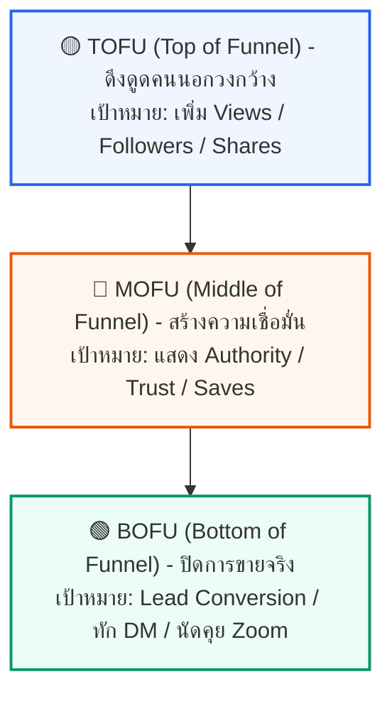

# 📐 Funnel Stage & Content Format: พิมพ์เขียวกลยุทธ์คอนเทนต์ 3 ระดับ
> **Nick | Financetry**  
> *พิมพ์เขียวการจัดระดับการตัดสินใจของผู้ชมเพื่อแปรเปลี่ยนยอดวิวจากคนแปลกหน้าให้กลายเป็นลูกค้ารายใหญ่ผ่านโครงสร้างการเล่าเรื่องที่เป็นระบบ*

---

## 📐 โครงสร้างกรวยลูกค้า (Personal Brand Funnel Workflow)

การผลิตคอนเทนต์อย่างไร้ทิศทางจะส่งผลให้ช่องเติบโตแต่ตัวเลข แต่ไม่สร้างรายได้ การแบ่งระดับคอนเทนต์ตามการรับรู้และการตัดสินใจของลูกค้าออกเป็น 3 ขั้นหลัก (TOFU ➔ MOFU ➔ BOFU) จะช่วยให้เราสามารถออกแบบ **Hook, Body และ CTA** ให้สอดรับกับความพร้อมของผู้ชมได้อย่างแม่นยำ:

---

## 🎛️ เจาะลึกระดับคอนเทนต์และฟอร์แมต (Funnel & Format Breakdown)

### 🟡 1. TOFU (Top of the Funnel) – ขั้นสร้างการรับรู้ (Awareness)
> **เป้าหมายหลัก:** ดึงความสนใจจากคนวงนอก (Cold Audience) ให้หยุดดู เพิ่มยอดวิว (Views) ยอดแชร์ (Shares) และผู้ติดตามใหม่ (Followers) คอนเทนต์ในชั้นนี้ต้อง **"ย่อยง่าย เข้าถึงคนหมู่มาก และเล่นกับอารมณ์หรือความเชื่อร่วม"**

#### 🎬 ฟอร์แมตทั้งหมดในชั้น TOFU:
*   **Ratings (จัดเรตติ้ง):** *[จากคลังเดิม]*
    *   *แนวทาง:* ให้คะแนนจัดเกรดแอปพลิเคชันการเงิน, กองทุนรวม หรือโครงสร้างแผนลดหย่อนภาษี/ออมเงินแบบต่างๆ เพื่อสร้างเกณฑ์เปรียบเทียบที่เข้าใจง่าย
*   **Comparisons (การเปรียบเทียบเชิงแมส):** *[จากคลังเดิม]*
    *   *แนวทาง:* เทียบกันชัดๆ สั้นๆ แบบเข้าใจง่าย เช่น *"ย้ายเงินสดไปวางไว้ตรงไหนเพื่อ 'ลดภาษี' โดยที่กระแสเงินสดส่วนบุคคลไม่สะดุด?"* เพื่อเปิดหัวดักสายตา
*   **Tier Lists (จัดอันดับเทียร์):** *[จากคลังเดิม]*
    *   *แนวทาง:* จัดอันดับเครื่องมือการเงินจากระดับ S-Tier ไปถึง D-Tier (เช่น เครื่องมือเก็บออม/ลดหย่อนที่คุ้มค่าที่สุด) เข้าถึงคนกลุ่มกว้างได้ทันที
*   **The Skit / POV (จำลองสถานการณ์):**
    *   *แนวทาง:* จำลองสถานการณ์น่ารักๆ หรือตลกขบขันในออฟฟิศ/ชีวิตการทำงาน คนดูทั่วไปเข้าถึงง่าย เกิดอารมณ์ร่วม (Relatable) และกดแชร์ต่อได้เร็วที่สุด
*   **Myth Buster / Common Mistakes (ขยี้ความเชื่อผิดๆ):**
    *   *แนวทาง:* "หยุดเข้าใจผิดเรื่อง..." หรือ "คน 90% มักพลาดเรื่องนี้..." กระตุ้นความอยากรู้อยากเห็น (Curiosity Hook) แย้งความเชื่อเดิมเพื่อดึงคนให้หยุดฟังและถกเถียง
*   **Fake Situations ("What I would do if..."):**
    *   *แนวทาง:* โจทย์สถานการณ์สมมติที่ท้าทายและสุดโต่ง เช่น *"ถ้าเงินเก็บเหลือ 0 บาท จะหาเงินแสนแรกใหม่ยังไงใน 30 วัน?"* เรียกกระแสความสนใจจากคนกลุ่มกว้างได้ดีมาก
*   **The Commentary / Reaction (เกาะกระแสประเด็นร้อน):**
    *   *แนวทาง:* การหยิบประเด็นร้อน ดราม่า หรือข่าวสารในกระแสมาวิเคราะห์อย่างรวดเร็ว เพื่อดึงดูดสายตาคนนอกเข้ามายังช่องของคุณ
*   **Bracket Ranking / Ranking (จัดอันดับท้าชน):**
    *   *แนวทาง:* การจัดอันดับที่สร้างข้อถกเถียง ชวนให้คนดูเข้ามาคอมเมนต์ปะทะคารมถกเถียงกันในช่องเพื่อกระตุ้นอัลกอริทึม
*   **The Aesthetic / Mood Video & Photo Dump (เสพภาพเพลิน):**
    *   *แนวทาง:* ใช้ภาพสวยงาม เพลงในกระแส หรือการรวบรวมรูปภาพนิ่งย่อยง่าย ดักคนดูกลุ่มกว้างที่ไม่ได้ต้องการเนื้อหาหนักๆ ในทันที

---

### 🔵 2. MOFU (Middle of the Funnel) – ขั้นพิจารณาและสร้างความเชื่อมั่น (Consideration & Trust)
> **เป้าหมายหลัก:** เปลี่ยนจาก "คนดูทั่วไป" ให้กลายเป็น "ผู้ติดตามที่สนใจจริง" (Warm Audience) เน้นการแสดงศักยภาพ ความเชี่ยวชาญ (Authority) และเปิดเผยเบื้องหลังเพื่อสร้างความสนิทใจ ความเป็นมนุษย์ที่โปร่งใส

#### 🎬 ฟอร์แมตทั้งหมดในชั้น MOFU:
*   **The Expert Talking Head (พูดหน้ากล้องระดับลึก):**
    *   *แนวทาง:* ส่งมอบความรู้ระดับลึกในอุตสาหกรรมอย่างชัดเจนและทรงพลัง พิสูจน์ว่าคุณรู้ลึก รู้จริงในสิ่งที่ทำ และสร้างภาพจำ (Branding) ในฐานะผู้เชี่ยวชาญตัวจริง
*   **Green Screen (กรีนสกรีนอธิบายหน้าจอ):** *[จากคลังเดิม]*
    *   *แนวทาง:* การใช้รูปภาพ กราฟ หรือตารางสเปรดชีตมาเป็นพื้นหลังแล้วชี้ประเด็นสำคัญอธิบายให้เข้าใจง่าย ได้รายละเอียดแบบโปร่งใส
*   **Step-by-Step Tutorial & Educational Tips / Hacks (สอนจับมือทำ):**
    *   *แนวทาง:* สอนแบบจับมือทำ แจกทริคลัด ขยี้คุณค่า (Value) ให้คนดูรู้สึกว่า *"ช่องนี้แจกความรู้ฟรีแบบไม่กั๊ก"* เพื่อกระตุ้นยอดเซฟ (Saves) เก็บไว้ดูซ้ำ
*   **My Story Videos (เล่าเรื่องความผิดพลาดและจุดเปลี่ยน):**
    *   *แนวทาง:* เล่าอดีต ความล้มเหลว และจุดเปลี่ยนของตัวคุณเอง คอนเทนต์นี้ไม่ได้เน้นขายความรู้ แต่เน้นขาย "ตัวตน" (Personal Brand) เพื่อสร้างสาวกตัวจริง
*   **Day in the Life (พาทัวร์วิถีชีวิตเบื้องหลัง):**
    *   *แนวทาง:* โชว์วิถีชีวิต เบื้องหลังการทำงาน การจัดโต๊ะ หรือการใช้ชีวิตประจำวัน ทำให้แบรนด์มีชีวิต มีความเป็นมนุษย์ (Humanize the Brand) ไม่ดูเป็นทางการจนเกินไป
*   **Series (Build in Public - พาเติบโตไปด้วยกัน):**
    *   *แนวทาง:* พาคนดูเดินทางร่วมกับโปรเจกต์ระยะยาว (เช่น ปั้นพอร์ตการเงินทดลอง ➔ 1 แสนบาท) ทำให้คนดูลุ้นและติดตามทุกตอนอย่างสม่ำเสมอ
*   **Cost Breakdowns & Numbers / Metric Updates (เปิดงบ/ตัวเลขโปร่งใส):**
    *   *แนวทาง:* การเปิดงบหลังบ้าน ยอดขาย ต้นทุน หรือการคำนวณเบี้ยประกันจริง ความโปร่งใสในขั้นนี้จะทำลายกำแพงความระแวงของลูกค้าลงอย่างสิ้นเชิง
*   **Retrospectives (Lessons & Mistakes - บทเรียนจากความล้มเหลว):**
    *   *แนวทาง:* กล้ายอมรับความผิดพลาดในอดีตและถอดบทเรียนให้คนอื่นฟัง แสดงถึงความเก๋า ความจริงใจ และความเป็นมืออาชีพที่ไม่กลัวที่จะเรียนรู้

---

### 🟢 3. BOFU (Bottom of the Funnel) – ขั้นปิดการขาย (Conversion & Decision)
> **เป้าหมายหลัก:** เปลี่ยนผู้ติดตามคุณภาพ (Hot Audience) ให้กลายเป็นลูกค้าผู้ซื้อบริการจริง ขจัดข้อโต้แย้งข้อสุดท้ายในหัวของพวกเขา พิสูจน์ผลลัพธ์แบบไร้ข้อกังขา และใช้ Call to Action (CTA) ปิดดีลทักเข้า DM หรือ Zoom

#### 🎬 ฟอร์แมตทั้งหมดในชั้น BOFU:
*   **แผนผังระบบการเงิน / ชาร์ตกระแสเงิน (แผนผังระบบการเงิน):** *[จากคลังเดิม]*
    *   *แนวทาง:* การเขียนหรือวาดแผนผังขั้นตอนการวางโครงสร้างการเงินและการบริหารปกป้องสินทรัพย์ (Wealth Preservation) อย่างมีระบบระเบียบและหลักการชัดเจน
*   **Client Case Studies (เคสความสำเร็จของลูกค้า):** *[จากคลังเดิม]*
    *   *แนวทาง:* การสรุปเคสจริงที่ช่วยลูกค้าแก้ปัญหาทางการเงินและการปกป้องสินทรัพย์ได้สำเร็จเชิงตัวเลข เป็นข้อยืนยันความน่าเชื่อถือ
*   **1-on-1 Discovery Call Pitch (ตรวจสุขภาพการเงินคัดลีด):** *[จากคลังเดิม]*
    *   *แนวทาง:* การเชิญชวนและท้าทายให้คนดูเข้ามาตรวจสุขภาพการเงินและจัดสรรสิทธิประโยชน์ส่วนตัว (Financial Health Audit) เพื่อหาจุดรั่วไหลและอุดความเสี่ยงใน Zoom
*   **Transformation / Before & After (ผลลัพธ์ก่อน-หลัง):**
    *   *แนวทาง:* โชว์ผลลัพธ์ของจริงจากการใช้บริการหรือแผนการเงินของคุณ (เช่น ลูกค้ายื่นภาษีเซฟไปได้หลักแสน หรืออุดความเสี่ยงได้สมบูรณ์) เป็นหลักฐานคาตา (Social Proof) ที่ชัดเจนที่สุด
*   **Bad, Good, Great & Side-by-Side Comparison (เปรียบเทียบเชิงลึก):**
    *   *แนวทาง:* เปรียบเทียบให้เห็นชัดๆ ว่าทำไมต้องเลือกบริการวางแผนเต็มพิกัด (Great) หรือเปรียบเทียบแบรนด์เรา vs คู่แข่ง เพื่อเคลียร์ข้อสงสัยด่านสุดท้ายในใจลูกค้า
*   **Fake Case Studies (จำลองการแก้ปัญหาแบรนด์ใหญ่/คนดัง):**
    *   *แนวทาง:* กระบวนการแก้ปัญหาการเงินที่เฉียบคมในคลิปจำลองจะสะกิดใจกลุ่มลูกค้ากระเป๋าหนัก (High-ticket Clients) ว่าคุณคือผู้เชี่ยวชาญที่เข้ามาช่วยพวกเขาได้จริง
*   **Q&A (Objection Handling - ตอบคำถามคาใจ):**
    *   *แนวทาง:* หยิบคำถามด่านสุดท้าย เช่น *"ราคาเท่าไหร่?"* *"ต่างจากแบรนด์อื่นยังไง?"* มาตอบหน้ากล้องตรงๆ เป็นการทลายกำแพงข้อสุดท้ายก่อนกดจ่ายเงิน
*   **The Unboxing / ASMR (โชว์ของจริง/รีวิวชิ้นงาน):**
    *   *แนวทาง:* โชว์ความใส่ใจ ดีเทลกระดาษสมุดคู่มือแผนการเงิน หรือหน้าอินเทอร์เฟซแอปพลิเคชันส่วนตัว เพื่อสร้างความอยากได้ทางอารมณ์และกระตุ้นการตัดสินใจซื้อในทันที

---

## 🗺️ สรุปพิมพ์เขียวการเลือกใช้สคริปต์ (Funnel Workflow)

| ระดับ Funnel | หน้าที่และจริตคอนเทนต์ | ฟอร์แมตที่แนะนำ | ตัวอย่างประโยคเปิด (Hook) | ตัวอย่างประโยคปิด (CTA) |
| :--- | :--- | :--- | :--- | :--- |
| **🟡 TOFU** *(ดึงคนใหม่)* | เน้นกว้าง, เข้าถึงง่าย, หักล้างความเชื่อเดิม, เน้นยอดวิวและยอดแชร์สูง | Ratings, Comparisons, Tier Lists, Skit/POV, Myth Buster, Fake Situation, Reaction | • *"หยุดทำแบบนี้ถ้าไม่อยากเจ๊ง..."* • *"ถ้าพรุ่งนี้ผมเหลือเงิน 0 บาท... นี่คือสิ่งที่ผมจะทำ"* | • *"กดติดตามช่องนี้ไว้เพื่อไม่ให้พลาดทริคธุรกิจดีๆ"* • *"ชอบทางเลือกไหน คอมเมนต์มาบอกกันหน่อย"* |
| **🔵 MOFU** *(สร้างความเชื่อมั่น)* | เน้นเจาะลึก, แจกทริคขยี้คุณค่าฟรี, โปร่งใส, โชว์วิถีชีวิตเบื้องหลัง | Expert Talking Head, Green Screen, Step-by-Step Tutorial, Day in the Life, My Story, Cost Breakdown | • *"นี่คือกระบวนการหลังบ้านที่ไม่มีใครยอมบอกคุณ..."* • *"2 ทริคจัดสรรภาษีนี้จะเปลี่ยนเงินรั่วไหลให้เป็นเงินออม"* | • *"เซฟคลิปนี้เก็บไว้ทำตามได้เลยครับ เดี๋ยวหาไม่เจอ"* • *"กดแชร์คลิปนี้ให้เพื่อนที่ยังเก็บเงินไม่ได้ด่วนเลย"* |
| **🟢 BOFU** *(ปิดการขาย)* | เน้นผลลัพธ์จริงคาตา, ทลายกำแพงการเงิน, ขจัดข้อโต้แย้งด่านสุดท้าย | แผนผังระบบการเงิน, Client Case Studies, Discovery Call, Before & After, Side-by-Side, Fake Case Studies, Q&A | • *"มาดูกันว่าลูกค้าของผมเซฟเงินภาษีไปได้หลักแสนใน 1 เดือนได้ยังไง"* • *"เบี้ยประกันสุขภาพแพงเกินจริง? คลิปนี้ตอบทุกคำถามครับ"* | • *"พิมพ์คำว่า [INSURE] เดี๋ยวผมทักส่งตารางเปรียบเทียบเบี้ยให้ใน DM ทันที"* • *"พิมพ์คำว่า [matrix] เพื่อดาวน์โหลดแบบคำนวณภาษีส่วนตัวฟรี"* |

---

> [!IMPORTANT]
> **กฎเหล็กการร้อยเรียงสคริปต์:** 
> ห้ามข้ามขั้นเด็ดขาด! อย่าพยายามใช้ CTA ปิดการขาย (BOFU) ในคลิปที่ปูเนื้อหามาแบบกว้างๆ (TOFU) เพราะคนดูวงนอกยังไม่รู้จักและเชื่อใจคุณพอที่จะลงมือทำ การจัดระเบียบโครงสร้างกรวยนี้จะช่วยให้ผู้ชมเดินทางจาก **"คนแปลกหน้า ➔ แฟนคลับ ➔ ลูกค้ารายใหญ่"** ได้อย่างเป็นธรรมชาติและยั่งยืน
