# 🛠️ Production Guide: คู่มือการถ่ายทำและตั้งค่าเทคนิคหลังบ้าน
> **Nick | Financetry**  
> *คู่มือรวมขั้นตอนการทำงาน ภาคปฏิบัติการตั้งค่ากล้อง การตั้งค่าโปรเจกต์และขั้นตอนตัดต่อใน CapCut การมิกซ์เสียง และคลังข้อมูลทรัพย์สินสีกระตุ้นอารมณ์สำหรับวิดีโอสั้นระดับพรีเมียม*

---

## 📌 1. One-Day Production Workflow (คลิปสั้นรันจบในวันเดียว)

การรันกระบวนการผลิตวิดีโอสั้นอย่างราบรื่นแบบครีเอเตอร์ระดับสากล ให้ยึดแนวปฏิบัติ 4 ขั้นตอนพร้อมระบบการทำงานภาคปฏิบัติดังนี้:

1. **ขั้นที่ 1: Scrape & Idea** 
   * ค้นหาแก่นไอเดียและคลิปไวรัลในนิชผ่านเครื่องมือ เพื่อวิเคราะห์โครงสร้างบทและคำฮุกสะดุดสายตา
2. **ขั้นที่ 2: Scripting & Analog Roadmapping (การร่างสคริปต์และจัดทำแผนที่กระดาษ)**
   * เขียนบทพูดแบบ Word-for-Word และเลือกเพลงประกอบที่เหมาะสมตั้งแต่ต้นเพื่อซิงค์จังหวะ
   * **💡 Analog Check-off Hack:** ในคืนก่อนถ่ายทำ ให้ทำการ **"พิมพ์สคริปต์และ Shot List ออกมาเป็นกระดาษจริง"** และพกปากกาติดตัวไปหน้างาน การขีดฆ่าช็อตที่ถ่ายเสร็จสมบูรณ์ด้วยลายมือจริงบนกระดาษ จะช่วยกระตุ้น **โดปามีน (Dopamine Hit)** ลดความกดดันสะสม และควบคุมความก้าวหน้าไม่ให้ตกหล่นได้ดีกว่าระบบดิจิทัล 100%
3. **ขั้นที่ 3: Filming & Smart Setup (การถ่ายทำตามโลเคชันและการจัดตารางเวลา)**
   * **⏱️ Gamified Time Blocking & Buffer:** จัดเวลาในแต่ละงานเป็นบล็อก ๆ (Time Blocking) เพื่อสร้างแรงกดดันที่ดี แต่ต้องบวก **"เวลาเผื่อเหลือเผื่อขาด (Buffer)"** เสมอสำหรับข้อผิดพลาด เช่น อุปกรณ์เสีย ขาตั้งกล้องหลุด หรือลืมของ
   * **🍳 Morning Light Race & Meal Prep:** หากต้องการแสงเช้าที่สวยงามและนุ่มนวล (Morning Light) ให้สลัดงานทำอาหารในเช้าวันถ่ายทำทิ้งไป โดยใช้วิธีเตรียมนมอุ่น/อาหารสำเร็จรูป (Meal Prep) ล่วงหน้า เพื่อประหยัดเวลาและรีบวิ่งไปคว้าแสงธรรมชาติ
   * **📍 Location-Based Shooting (ถ่ายข้ามลำดับเวลาตามสถานที่):** ห้ามถ่ายไล่ตามวินาทีของคลิป (Non-chronological) แต่ให้ **กรุ๊ปช็อตตามโลเคชันหรือชุดพิกัดกล้อง** เช่น หากฉากเปิดและฉากปิดของคลิปเกิดบนโต๊ะทำงานเหมือนกัน ให้จัดชุดกล้องและถ่ายทั้งสองซีนให้เสร็จในครั้งเดียว ก่อนจะถอดอุปกรณ์ย้ายไปถ่ายฉาก B-Roll นอกสถานที่
   * **🗺️ ระบบการหาและจัดเก็บสถานที่ระดับมือโปร (Scout, Stash & Recall System):**
     * **1. Scout (หาสถานที่):** ใช้เวลาว่างขับรถหรือเดินเปรียบเทียบในทิศทางที่ไม่คุ้นเคยแบบจำกัดช่วงเวลา (Time-block) พกเพียงสมาร์ทโฟน Nothing Phone 2a และสมุดจด เพื่อส่องหามุมสวยๆ ในที่สาธารณะโดยไม่ต้องขนกล้องใหญ่ไปให้สะดุดตาใคร
     * **2. Stash (บันทึกพิกัด):** ทันทีที่พบมุมถ่ายทำสวยๆ ให้เปิดแอป **Google Maps** แล้วปักหมุดบันทึก (Save Pin) ลงในโฟลเดอร์ส่วนตัวแยกเป็นชื่อโฟลเดอร์สำหรับเมืองหรือนิชนั้นๆ ทันที
     * **3. Recall (ดึงมาแมตช์สคริปต์):** เมื่อกลับถึงบ้านและเริ่มขั้นตอนเขียนบทพูด (Writing phase) ให้เปิด Google Maps ของคุณขึ้นมาบนจอคอมพิวเตอร์แบบเคียงคู่กัน (Side-by-Side) เพื่อดึงพิกัดสถานที่ในสต็อกมาวางคู่กับบทพูดและฟุตเทจ B-Roll ล่วงหน้า 100% ป้องกันอาการหลงมุมหน้างาน
   * **📸 การใช้แอปจำลองมุมมองเลนส์ (Focal Length Simulation):**
     * เวลาไปหาโลเคชันห้ามใช้แอปกล้องธรรมดา แต่ให้ใช้แอปจำลองขนาดเลนส์หรือช่องมองภาพของผู้กำกับ (Director's Viewfinder เช่น *Artemis Pro*) ในมือถือ เพื่อให้เห็นมิติภาพและทางยาวโฟกัสจริง (Focal Lengths) ล่วงหน้า ว่าการยืนในจุดนี้ผ่านขนาดภาพกว้างหรือแคบจะให้ Vibe รู้สึกอย่างไรโดยไม่ต้องถอดเลนส์เข้าออกจริง
   * **📐 การคัดเลือกจุดภาพและทิศทางแสง (Leading Lines & Light Fall):**
     * คัดเลือกสถานที่ที่มีเส้นนำสายตาชัดเจน (Leading Lines) เช่น ขอบถนน เสาไฟ หรือขอบบันไดวน และเลือกมุมที่อยู่ในระดับที่สูงหรือปลอดโปร่ง (เช่น ยอดเนินเขา) เพื่อให้แสงธรรมชาติ (Natural light) ตกลงบนใบหน้าคุณ Nick ได้สวยงามนุ่มนวล หลีกเลี่ยงเงาทึบ (High-rise Shadows) ที่ตกทอดมาจากตึกสูงโดยรอบ
   * **🎒 Pre-Shoot Gear Checklist (เช็คลิสต์ป้องกันลืมของ):** ท่องให้ขึ้นใจว่า *"ห้าม raw dog วันถ่ายทำโดยไม่ตรวจสอบของ"* ต้องเช็คอุปกรณ์ตามเช็คลิสต์กายภาพทุกครั้งก่อนออกเดินทาง: ตัวกล้อง Pocket 3, โทรศัพท์ Nothing Phone 2a, การ์ด SD (ใส่ในเครื่องแล้วหรือยัง?), ฟิลเตอร์ VND, แบตเตอรี่สำรอง, ไมโครโฟน DJI Mic 2 และ Boya V-30 เพื่อไม่ให้เสียเที่ยว
   * **✈️ กลยุทธ์การออกกองและเตรียมงานถ่ายนอกสถานที่ (Big Shoot Travel Strategy):**
     * **1. กฎเดินตรวจของ 3 รอบ (3-Round House Walkthrough Check):** แม้ว่าจะเช็คลิสต์อุปกรณ์เสร็จแล้ว ก่อนก้าวเท้าออกจากห้องทำงานหรือสตูดิโอ **คุณ Nick ต้องเดินสำรวจรอบสถานที่จริงอีก 2-3 รอบ** เพื่อมองหาของชิ้นเล็กๆ ที่มักตกหล่นเป็นประจำ (เช่น สายชาร์จมือถือ, อะแดปเตอร์แปลงไฟ, การ์ดรีดเดอร์, หรือแบตเตอรี่สำรองที่ยังคาอยู่ในแท่นชาร์จ)
     * **2. เวลาเผื่อสำหรับงานเบื้องหลัง (Vlog/BTS Travel Overhead):** การเดินทางไปถ่ายทำนอกสถานที่หรือต่างประเทศหากพ่วงภารกิจถ่ายทำ Vlog/Behind the Scenes ด้วย **จะกินเวลาเดินทางจริงเพิ่มขึ้นจากปกติประมาณ 30% - 50% (บวกเพิ่มอย่างน้อย 1 ชั่วโมง ต่อการเดินทาง 3 ชั่วโมง)** เพราะต้องจอดรถ ลงไปถ่ายภาพขยับ รถวิ่งผ่าน และวนกลับมาเก็บกล้อง ควรคำนวณเวลาส่วนนี้ลงในปฏิทินเพื่อป้องกันอาการหลังเดดไลน์เลท
     * **3. การทำ Spec Ads ดึงดูดลูกค้าระดับสูง:** เพื่อขยายสเกลแบรนด์ Nick | Financetry ไปสู่การจับกลุ่มตลาดธุรกิจ High-ticket หรือรับงานจัดระบบสเกลใหญ่ ให้ทำสัญญาสวัสดิการหรือแคมเปญในลักษณะ Spec Ads (การสร้างคลิปพรีเซนต์จำลองหรือแผนโครงสร้างการเงินสมมุติโดยใส่ฝีมือแบบจัดเต็มไร้ขอบเขตจำกัด) ลง LinkedIn และช่องทางตนเอง เพื่อสร้างโอกาสเชิงรุกในการเข้าหาเอเจนซี่และลูกค้ารายใหญ่
     * **4. ปราศจากอัตตาและความแข็งแกร่งทางอารมณ์ (Ego-Free & Mental Strength):** การทำผลงานเชิงพาณิชย์ระดับพรีเมียมให้ยึดความต้องการและโจทย์ตัวเลขของลูกค้าเป็นตัวตั้ง (Remove your ego) โดยรักษาความสตรองทางจิตใจ (Mental got to be strong) ตั้งแต่เตรียมตัวเตรียมแผนถ่ายทำ ไปจนถึงการแก้ปัญหาหน้างานเฉลยดีลงาน
   * **🧠 1-Sentence Memorization & Grueling Battle:** ยอมรับความจริงว่าไม่มีครีเอเตอร์คนไหนพูดเป๊ะในเทคเดียว การจำสคริปต์ทีละประโยคครึ่ง ➡️ พูด ➡️ หยุดจ้องบทประโยคถัดไป แล้วนำมาหั่นต่อ Jump Cut คือเรื่องปกติของครีเอเตอร์ระดับสากล ไม่จำเป็นต้องพยายามทำตัวสมบูรณ์แบบหน้าเลนส์
   * **🌿 Out of Office / Touching Grass Vibe:** แม้เนื้อหาการเงินจะดูเคร่งเครียด แต่การพาแบรนด์ Nick | Financetry ออกไปถ่ายทำภายนอกอาคาร (เช่น สวนสาธารณะ, คาเฟ่วิวสวย, ทางเดินรับแสงธรรมชาติ) จะช่วยดึงดูดสายตาคนดูรุ่นใหม่ (Leo Persona) ได้ดีกว่า และให้ความรู้สึกจริงใจ สดใหม่ เข้าถึงง่ายกว่าการนั่งอยู่โต๊ะคอมอย่างเดียว
   * **🕶️ Exposure & Skin Glow Control:** ติดตั้งฟิลเตอร์แม่เหล็ก **2-in-1 (VND + Black Mist 1/4)** ที่มีอยู่เข้าหน้าเลนส์เสมอ เพื่อเกลี่ยผิวหน้าให้นุ่มนวลน่ามอง ลดเงาสะท้อนกระด้าง และใช้ส่วน VND ลดแสงอาทิตย์/แสงจัดหน้างาน ช่วยรักษาความลื่นไหลระดับสเปกกล้องได้สมบูรณ์แบบ
4. **ขั้นที่ 4: Post-Production (การตัดต่ออย่างมีระบบด้วย CapCut)**
   * ตัดต่อล้างเดดแอร์ (Trimming Dead Air) นำเข้าไฟล์ D-Log M เกรดสีผิวให้ผุดผ่อง ใส่เสียงเอฟเฟกต์ตามคีย์เพลงประกอบ และส่งออกด้วยสูตรส่งออกของ CapCut เพื่อเลี่ยงการบีบอัดไฟล์บนโซเชียลมีเดีย

---

## 📸 2. Camera Settings & Visual Design (การตั้งค่ากล้องและสไตล์ภาพ)

เพื่อให้ได้ไฟล์ดิบที่คมชัด มีไดนามิกกว้าง และยืดหยุ่นที่สุดสำหรับนำไปปรับแต่งสีต่อใน CapCut ให้ยึดเกณฑ์การตั้งค่าต่อไปนี้:

### ⚙️ การตั้งค่ากล้องถ่ายทำ (DJI Osmo Pocket 3)

| หัวข้อการตั้งค่า | ค่าที่แนะนำ (Recommended Value) | หมายเหตุ / เหตุผลทางเทคนิค |
| :--- | :--- | :--- |
| **ความละเอียด (Resolution)** | **4K (16:9) หรือ 4K แนวตั้ง (9:16)** | เลือกถ่ายตามความสะดวก (หากเน้นความคล่องตัวให้หมุนจอถ่าย 9:16 ตรง ๆ) |
| **อัตราเฟรม (Frame Rate)** | **24 fps หรือ 30 fps** | ยึดตามมาตรฐานสากลเพื่อความลื่นไหลพรีเมียม |
| **โหมดควบคุมแสง** | **Manual (M)** | ป้องกันแสงสว่างวูบวาบระหว่างพูดหน้ากล้อง |
| **สปีดชัตเตอร์ (Shutter Speed)** | **1/50** (สำหรับ 24fps) หรือ **1/60** (สำหรับ 30fps) | รักษา Motion Blur ที่เป็นธรรมชาติ (สัมพันธ์กับกฎ 180 องศา) |
| **ISO** | **50 - 3,200** (พยายามล็อกไว้ต่ำที่สุด) | รักษาคุณภาพเนื้อไฟล์ หลีกเลี่ยงสัญญาณรบกวน (Noise) ในร่ม |
| **การชดเชยแสง (EV)** | **-0.3 ถึง -0.7** | ป้องกันแสงส่วนไฮไลท์ล้น (Overexposed) ช่วยเก็บดีเทลของผิวได้ดีขึ้น |
| **โหมดสี (Color Mode)** | **D-Log M (10-bit)** หรือ **Normal** | แนะนำใช้ **D-Log M** เพื่อความพรีเมียม ยืดหยุ่นในการเกรดสี หรือใช้ **Normal** หากต้องการรีบส่งงานด่วน |
| **ไวท์บาลานซ์ (White Balance)** | **Manual (ตั้งฟิกซ์ค่าตามสภาพแสง เช่น 5000K-5600K)** | ป้องกันโทนสีผิวและพื้นหลังเปลี่ยนไปมาระหว่างพูด |
| **โฟกัส (Focus Mode)** | **Continuous AF** (Face/Object Tracking) | ใช้ระบบแทร็กใบหน้าและดวงตาอัจฉริยะเพื่อให้โฟกัสเป๊ะตลอดเวลา |
| **ความคมชัด (Sharpness)** | **-2** | ลดความคมทางดิจิทัลที่ดูปลอมลง ให้ผิวดูละมุนและได้มู้ดภาพยนตร์แบบ Cinematic |
| **การลดสัญญาณรบกวน (Noise Reduction)** | **-2** | ป้องกันไม่ให้กล้องเกลี่ยผิวจนเป็นวุ้นเหมือนแผ่นพลาสติก เพื่อคงรายละเอียดมิติผิวตามธรรมชาติไว้ |

### 📸 สูตรลับ: การทำพื้นหลังเบลอสวยงามด้วยเซนเซอร์ 1 นิ้วของ Pocket 3
DJI Osmo Pocket 3 มาพร้อมเซนเซอร์ขนาดใหญ่ 1 นิ้ว และรูรับแสงกว้าง f/2.0 ซึ่งให้มิติชัดตื้น (Background Blur) ที่สวยงามและเป็นธรรมชาติโดยไม่ต้องใช้ซอฟต์แวร์ช่วย:
1. **จัดระยะห่าง (Distance):** ให้ตัวคุณยืน **ห่างจากฉากหลังให้มากที่สุด** และตั้งกล้อง Osmo Pocket 3 **ไว้ใกล้ตัวคุณพอประมาณ** (ระยะห่างประมาณ 1 เมตร กำลังได้เฟรมครึ่งตัวที่สวยงาม)
2. **ธรรมชาติ 100%:** ไม่จำเป็นต้องเปิดโหมดบิวตี้หรือโหมดเบลอปลอมจากซอฟต์แวร์ ปล่อยให้มิติเลนส์สร้างโบเก้ฉากหลังนุ่ม ๆ เองเพื่อความหรูหราพรีเมียม
3. **ติดตั้งฟิลเตอร์ Mist (Black Mist Filter):** หากต้องการผิวที่นวลตาเป็นธรรมชาติและแสงฟุ้ง ๆ (Dreamy cinematic glow) ให้ติดฟิลเตอร์ Mist ที่หัวเลนส์แม่เหล็ก

### 🎬 หลักการถ่ายทำและจัดเฟรมภาพให้ Cinematic (Cinematic Shot Rules by Val)
เพื่อให้วิดีโอ Reels โดดเด่นกว่าคู่แข่ง ให้ประยุกต์ใช้กฎทางภาพ 3 ข้อนี้:
* ☀️ **Good Lighting (แสงดีมีชัยไปกว่าครึ่ง):** แสงธรรมชาติคือแสงที่ดีและพรีเมียมที่สุดสำหรับการทำคอนเทนต์ หากถ่ายทำในห้อง ให้ตั้งกล้องถ่ายหันหน้าเข้าหาหน้าต่าง หรือใช้ซอฟต์ไลท์ (Soft Light) ส่องเฉียงเข้าหน้าเพื่อลบเงาและเพิ่มมิติ
* 📐 **Leave Space for Text (วางแผนพื้นที่สำหรับข้อความ):** ก่อนที่จะเริ่มกดอัดวิดีโอ ให้จินตนาการตำแหน่งที่จะใส่ On-Screen Text หรือคำอธิบายการเงินบนหน้าจอล่วงหน้าเสมอ (เช่น เอียงตัวอยู่ฝั่งขวาเล็กน้อยเพื่อเว้นที่ว่างกว้าง ๆ ฝั่งซ้ายสำหรับขึ้นแผนภาพหรือข้อความตัวโต)
* 🎥 **Use Smooth Camera Movements (การขยับกล้องที่ราบรื่น):** เพื่อความพรีเมียม ลื่นไหล และเสถียร ควรใช้ขาตั้งกล้อง (Tripod) หรือล็อกแกนกิมบอลของ Pocket 3 ไว้ให้มั่นคง หลีกเลี่ยงภาพสั่นไหวโดยไม่ตั้งใจ

🎙️ **ทางเลือกลดความกดดันสำหรับครีเอเตอร์สายชวนเขินหน้ากล้อง (Voiceover-First Workflow):**
หากคุณรู้สึกเกร็งหรืออายเมื่อต้องจ้องกล้องและพูดไปพร้อมกัน ให้ใช้กระบวนการทำงานแบบ **"อัดภาพก่อน พูดทีหลัง"** ดังนี้:
1. **ถ่ายวิดีโอก่อน (Film B-Roll First):** ถ่ายทำวิดีโอฟุตเทจการทำงาน ท่าทาง หรือบรรยากาศการวิเคราะห์ภาษีต่าง ๆ ของคุณ Nick ให้เสร็จสิ้นโดยไม่ต้องพูดออกเสียง
2. **เขียนสคริปต์เสียงและอัดเสียงภายหลัง (Record Voiceover):** เปิดดูฟุตเทจที่ถ่ายไว้ นำมาเรียงบนไทม์ไลน์ และบันทึกเสียงพูดอธิบายแยกต่างหากทีหลัง วิธีนี้จะช่วยให้คุณมีเวลาขัดเกลาน้ำเสียง จังหวะจะโคน และข้อความให้กระชับพรีเมียมที่สุดโดยปราศจากความกดดัน

### 🛠️ คู่มือการใช้งานอุปกรณ์เสริม Pocket 3 เพื่อความยืดหยุ่นในการถ่ายทำ (Kit & Accessories Guide)

เพื่อดึงศักยภาพสูงสุดของกล้อง Osmo Pocket 3 ออกมาใช้ในการสร้างมุมมองสร้างสรรค์และลื่นไหล ให้ประยุกต์ใช้อุปกรณ์เสริมทั้ง 3 ชนิดที่มีดังนี้:

1. **ฟิลเตอร์ลดแสงและฟุ้งแสงแบบ 2-in-1 (VND + Black Mist 1/4 Filter):**
   * **ทำไมต้องใช้:** ฟิลเตอร์ลูกผสมที่รวมสองฟังก์ชันไว้ด้วยกัน:
     * **ฝั่ง VND (Variable ND):** ปรับลดความเข้มของแสงได้ 5 สต็อป (VND2-32) ช่วยลดแสงเข้าสู่เซนเซอร์กว้าง f/2.0 ได้ทันทีในพื้นที่แสงจัด ทำให้คุณ Nick ถ่ายด้วย **D-Log M** และคงสปีดชัตเตอร์ตามกฎ 180 องศา (1/50 หรือ 1/60) เพื่อ Motion Blur ที่เป็นธรรมชาติ
     * **ฝั่ง Black Mist 1/4:** ช่วยกระจายแสงไฮไลท์ให้มีความฟุ้งละมุน (Dreamy cinematic glow) และช่วยเกลี่ยผิวหน้ากับสกินโทนให้ออกมาเนียนตา นุ่มนวล ดูพรีเมียมตั้งแต่ตอนถ่ายทำทันที
   * **การใช้จริง:** แปะตัวฟิลเตอร์แม่เหล็กเข้าหน้าเลนส์ ➔ หมุนปรับระดับความเข้ม VND (ตั้งแต่ 2 ถึง 32) ตามสภาพแสงหน้างานขณะถ่ายทำได้ทันทีโดยไม่ต้องถอดสลับฟิลเตอร์หลายชิ้น
2. **ตัวจับขาก้ามปู (Crab Claw Mount):**
   * **ทำไมต้องใช้:** เป็นขาก้ามปูยึดจับที่แข็งแรงและมั่นคงสูง ปลดล็อกข้อจำกัดของการใช้แค่ขาตั้งกล้องแบบตั้งพื้นแบบเดิมๆ
   * **การใช้จริง:** นำไปหนีบยึดเข้ากับขอบโต๊ะทำงาน, ราวบันไดวน (อาคารระพีสาคริก), ขอบเสา หรือกิ่งไม้ เพื่อจัดวางกล้องในจุดแปลกตา (Unusual Angle) ช่วยให้จัดมุมภาพแบบ Bird's-Eye View, Extreme Low Angle หรือห้อยหัวลงมาเพื่อสร้างสรรค์ Visual Hook ดึงดูดสายตาคนดูใน 3 วินาทีแรก
3. **เคสแม่เหล็กอเนกประสงค์ (Magnetic Cage):**
   * **ทำไมต้องใช้:** เคสโครงสร้างพิเศษที่มีแม่เหล็กแรงสูง (Strong Magnet) ฝังอยู่ด้านหลังของเคส
   * **การใช้จริง:** แปะกล้องเข้ากับวัสดุที่เป็นเหล็กหรือโลหะได้ทันที เช่น เสาเหล็ก, ประตูตู้เย็น (สำหรับทำซีนเปิดตู้เย็นโชว์ตัวเลข), โครงเครื่องซักผ้า, หรือขอบประตูเหล็ก ช่วยให้เราติดตั้งกล้องและเก็บภาพมุมมองแปลกใหม่ (POV / Environment Detail) ได้ทันทีในพื้นที่แคบหรือในที่ที่ไม่มีพื้นที่วางขาตั้งกล้อง

### 🎨 ชุดสีหลักประจำแบรนด์ (Branding Color Palettes)
การคุมโทนสีตัวอักษร ซับไตเติล และกรอบภาพใน Instagram จะช่วยสร้างภาพจำ (Brand Identity) ได้ทันที เลือกใช้ 1 ใน 5 พาเลทนี้ที่สะท้อนถึงตัวคุณมากที่สุด:

| พาเลทสี (Palette Style) | รหัสสีหลัก (Hex Code) | สไตล์ความรู้สึก (Aesthetic Tone) |
| :--- | :--- | :--- |
| **1. Sleek Professional** | `#011f7b` (Dark Blue) & `#FFBA09` (Warm Yellow) | ดูน่าเชื่อถือ มั่นคงแบบสถาบันการเงินระดับสูง แต่มีความหรูหรา |
| **2. Warm Classic** | `#AB1509` (Deep Red) & `#fff7d3` (Soft Yellow) | สไตล์อบอุ่น เป็นมิตร เข้าถึงง่าย มีกลิ่นอายความคลาสสิก |
| **3. Bold Tech** | `#323232` (Dark Gray) & `#FFDB00` (Vivid Yellow) | โมเดิร์น ทันสมัย ลุย ๆ เหมาะกับวัยรุ่นหรือคนรุ่นใหม่ที่ชอบเทคโนโลยี |
| **4. Organic Natural** | `#1A1A00` (Black-Olive) & `#FFFFCC` (Creamy Yellow) | สไตล์เรียบง่าย รักโลก อบอุ่น ผ่อนคลาย เน้นเรื่องความสมดุลชีวิต |
| **5. Retro Dynamic** | `#1A0033` (Retro Purple/Black) & `#FF4500` (Orange-Red) | โดดเด่น สะดุดสายตา มีพลังขับเคลื่อนสูง สไตล์ Retro Arcade |

---

## 🎞️ 3. CapCut Project Setup & Color Grading Workflow (สำหรับ DJI Osmo Pocket 3)

ขั้นตอนปฏิบัติสำหรับเริ่มต้นโครงการใหม่ใน CapCut (PC / Mac / Mobile) เพื่อตั้งค่าสัดส่วนภาพและจัดการระบบสีให้พรีเมียม:

### 🛠️ การตั้งค่าโปรเจกต์ (Project Settings)
1. **ขนาดและสัดส่วนวิดีโอ (Ratio):**
   * เข้าสู่หน้าตัดต่อ คลิกที่ **Ratio (อัตราส่วน)** ใต้จอแสดงผล ➔ เลือก **9:16** (แนวตั้งสำหรับ TikTok/Reels/Shorts)
2. **การนำเข้าไฟล์และจัดการประสิทธิภาพ (Proxy Mode):**
   * นำเข้าฟุตเทจ 4K จาก Osmo Pocket 3 เข้ามาใน Media Box
   * หากเครื่องคอมพิวเตอร์หรือมือถือกระตุก ให้ไปที่ **Settings (การตั้งค่า)** ของโปรเจกต์ ➔ เปิดใช้งาน **Proxy (ตัวแทน)** เพื่อช่วยให้เลื่อนไทม์ไลน์ได้ลื่นไหลขณะตัดต่อ

### 🔄 การเกรดสีไฟล์วิดีโอด้วยคู่มือระบบสีพรีเมียม (Color Grading & LUT Workflow)
สำหรับกล้อง DJI Osmo Pocket 3 ให้ทำการย้อมโทนสีโดยอ้างอิงขั้นตอนและแผนการเกรดสีอย่างละเอียดใน [Color-grading.md](file:///c:/AI-Agent-Workspace/creator/6-Editing/Color-grading.md) ซึ่งสรุปสเต็ปการใช้งานดังนี้:
1. **กรณีถ่ายทำในโหมด Normal (Rec.709):** 
   * ย้อมคลิปโดยตรงด้วยไฟล์ในโฟลเดอร์ [1-Rec709-Looks](file:///c:/AI-Agent-Workspace/creator/6-Editing/New%20LUTS/1-Rec709-Looks/) (เช่น `REC_WARM_casaca.cube` หรือ `Fresh_rec709_casaca.cube`) ปรับระดับความเข้มไว้ที่ **35% - 40%**
2. **กรณีถ่ายทำในโหมด D-Log M (LOG):** 
   * **สูตรลัด:** ดึงไฟล์จากโฟลเดอร์ [2-LOG-Looks](file:///c:/AI-Agent-Workspace/creator/6-Editing/New%20LUTS/2-LOG-Looks/) (เช่น `1-Pocket3-LOG-Fresh-Daily.cube` หรือ `2-Pocket3-LOG-Warm-Trust.cube`) มาย้อมคลิปตรง ๆ และปรับดึงความอิ่มสี (Saturation) ในโปรแกรมขึ้น `+25` ถึง `+30` เพื่อดึงความสดของเนื้อสีกลับมา
   * **สูตรมาตรฐาน:** แปลงภาพด้วยตัวแปลงสี `4-Pocket3-LOG-Base-Normalization.cube` (หรือใช้ CST ใน Resolve) เพื่อดึงกลับมาเป็น Rec.709 ด่านแรก จากนั้นทับด้วยโทนของกลุ่ม [1-Rec709-Looks](file:///c:/AI-Agent-Workspace/creator/6-Editing/New%20LUTS/1-Rec709-Looks/) ที่ความเข้ม **35% - 40%**
3. **ปรับแต่งแก้ไขพื้นฐานด้วยเครื่องมือ CapCut (Basic Adjustment):**
   * **Contrast (ความเปรียบต่าง):** ดึงขึ้น `+5` เพื่อมิติภาพ
   * **Shadows (เงา):** ดึงลง `-5` เพื่อถมความเข้มของเงา
   * **HSL (สีผิวส้ม):** เลือก HSL ➔ สีส้ม ➔ ลด Saturation ลงเล็กน้อย `-8` เพื่อสกินโทนขาวใสอมชมพูธรรมชาติพรีเมียม

---

## ✂️ 4. Professional CapCut Editing Techniques & Shortcuts (10 เคล็ดลับตัดต่อระดับโปร)

กระบวนการตัดต่อที่พรีเมียมต้องรวดเร็ว มีระเบียบ และให้ความสำคัญกับจังหวะจะโคน (Pacing) ของเนื้อหา ใช้เกณฑ์ปฏิบัติ 10 ข้อนี้ในโปรเจกต์ CapCut ทุกครั้ง:

### 🛠️ 10 เทคนิคจัดการไทม์ไลน์ขั้นสูง (10 Timeline Hacks)

1. **การตั้งค่าอัตราส่วนภาพล่วงหน้า (Aspect Ratio Lock):**
   * ก่อนลากคลิปลงไทม์ไลน์ ไปที่หน้าต่าง Preview/Details ➔ คลิก **Modify** ➔ เลือก **Aspect Ratio** ใน Timeline Settings เพื่อกำหนดขนาด เช่น **16:9** (แนวนอนสำหรับ YouTube) หรือ **9:16** (แนวตั้งสำหรับ Reels/TikTok) วิธีนี้ช่วยป้องกันการลากฟุตเทจผิดขนาดลงแล้วทำไทม์ไลน์เสียอัตราส่วน
2. **การตัดเศษเนื้อหาที่น่าเบื่อออก (Cut the Boring Parts):**
   * **Verbal Um (คำฟุ่มเฟือย/เสียงอึกอัก):** ตัดจังหวะเว้นหายใจนาน ๆ เออ อา หรือช่วงเงียบที่ทำให้การดำเนินเรื่องหยุดชะงัก
   * **Camera Um (จังหวะกล้องสั่น/จัดท่า):** ช่วง 0.5 วินาทีแรกที่กล้องบันทึกแต่ตัวเรายังนั่งนิ่งเตรียมตัวหรือขยับตัวเข้าที่ ให้ตัดทิ้งทันทีเพื่อให้เนื้อหาเปิดฉากเร็วที่สุด
3. **การจัดการเสียงด้วย AI อัจฉริยะ (Advanced Voice Restoration):**
   * เลือกคลิปเสียง ➔ ไปที่แท็บ **Audio** ➔ ติ๊กเลือก **Isolate Voice** (แยกเสียงพูดเด่นชัด), **Enhance Voice** (แต่งเสียงพูดให้ชัดเจน) หรือ **Reduce Noise** (ลดเสียงลม/เสียงรบกวนภายนอก)
   * *หมายเหตุ:* หลังจากเปิดใช้งาน ให้ลองเปิดฟังเสียงซ้ำ 2-3 รอบเพื่อป้องกันเสียงแห้งหรือฟังดูสังเคราะห์เกินไป
4. **การควบคุมความดังให้เสถียร (Audio Waveform dB Targeting):**
   * เปิดใช้แผงวัดระดับความดังเสียง (Waveform Indicator) ทางขวามือ
   * สำหรับเสียงพูดบรรยายหลัก คุมความดังให้อยู่ในเกณฑ์ **-6 dB ถึง -12 dB** เสมอ หากเสียงเบากว่า -12 dB ให้ปรับเพิ่มขึ้นในคลิป หาก Peak พุ่งใกล้ 0 dB หรือสูงกว่า ให้ปรับลดลงเพื่อเลี่ยงเสียงแตกพร่า
5. **ตัดต่อวิดีโอเข้าจังหวะบีตเพลงอัตโนมัติ (Auto Cut-to-Beat):**
   * นำเข้าแทร็กเพลงลงไทม์ไลน์ ➔ คลิกขวาหรือกดเลือกที่เพลง ➔ ใช้เครื่องมือ **Auto Mark Beats** ➔ เลือก **Beats 2**
   * ระบบจะสร้างจุดมาร์กสีฟ้าบนแทร็กเพลงอัตโนมัติ จากนั้นให้ตัดคลิปและเลื่อนช็อตให้ตรงกับมาร์ก เพื่อการเล่าเรื่องที่กระฉับกระเฉงเข้าจังหวะ
6. **ใช้เลเยอร์ปรับแต่ง (Adjustment Layers) เกรดสีรวดเดียว:**
   * หลีกเลี่ยงการแยกปรับสีคลิปทีละไฟล์ ให้ไปที่เมนู **Adjustment** ➔ เลือก **Custom Adjustment** ลากลงมาวางบนไทม์ไลน์ทับคลิปทั้งหมด
   * ปรับแสง ปรับ Contrast หรือย้อมค่า LUT บนเลเยอร์นี้ เพื่อให้ภาพและสีของวิดีโอมีความสม่ำเสมอเท่ากันตลอดทั้งคลิปและช่วยประหยัดเวลาได้อย่างมหาศาล
7. **วางข้อความตามกลยุทธ์การมีส่วนร่วม (Strategic Text Placement):**
   * **Intro (ช่วงต้นคลิป):** ใช้พาดหัวใหญ่เพื่อบอกบริบทและขยี้เรื่องด่วน ป้องกันคนเลื่อนหนี
   * **Middle (ช่วงกลางคลิป):** ใช้เขียนคีย์เวิร์ดหรือประเด็นย่อยเพื่อกระตุ้นให้จดจำจุดสำคัญ
   * **End (ช่วงท้ายคลิป):** ใช้ทิ้งท้ายรายละเอียด Call to Action (CTA) หรือเขียนคำถามท้าทายให้เกิดการพิมพ์คอมเมนต์
8. **ออกแบบข้อความและเลี่ยงพื้นที่ปุ่มบัง (Text Safety Margin):**
   * ตกแต่งฟอนต์ด้วยสีเด่น เช่น ฟอนต์ **Figtree Bold** ใส่ขอบ (Stroke) และเงา (Shadow) เพื่อความคมชัด
   * *ทริกห้ามพลาด:* ติ๊กเปิดไอคอน **TikTok/Instagram Overlay Preview** ในโปรแกรม เพื่อตรวจสอบว่าซับไตเติลหรือข้อความสำคัญของเราไม่โดนปุ่ม Like, Comment หรือแถบข้อมูลบัญชีของแอปบดบัง
9. **ระบบคำบรรยายอัตโนมัติและแอนิเมชันสะกดใจ (Auto Caption & Formatting):**
   * ไปที่แท็บ **Text** ➔ **Auto Captions** ➔ เลือกภาษา ➔ กด **Generate**
   * เลือกคลิปซับทั้งหมดพร้อมกัน ➔ ไปที่ **Animation** ➔ เลือกเอฟเฟกต์ **Bounce Out** (ตัวหนังสือเด้วยขยับตามคำที่พูดจริง) เพื่อความพรีเมียม
   * *ข้อควรระวัง:* ตรวจสอบหน้าต่างแก้ไขคำบรรยายทีละประโยคเสมอเพื่อแก้ไขคำสะกดผิดที่เกิดจากระบบพิมพ์ตามคำพูดอัตโนมัติ
10. **ใช้ปุ่มลัดกำหนดขอบเขตส่งออกคลิป (In/Out Point Export):**
    * ก่อนกดส่งออกไฟล์ (Export) ให้เลื่อนเคอร์เซอร์ไปจุดเริ่มต้นแล้วกดปุ่ม **`I` (Set In Point)** และเลื่อนไปจุดสิ้นสุดของคลิปแล้วกดปุ่ม **`O` (Set Out Point)**
    * ระบบจะไฮไลต์เฉพาะช่วงที่ต้องการใช้งาน ช่วยคัดแยกฟุตเทจเสีย ฟุตเทจค้างทางขวาออกจากคลิปจริงตอนส่งออก

---

### ⌨️ คีย์ลัดแป้นพิมพ์ลัดเพื่อความรวดเร็ว (Keyboard Shortcuts Mastery)

การตัดต่อที่ดีควรลดการจับเมาส์ลงและหันมาใช้คีย์บอร์ดมากขึ้นเพื่อเพิ่มความเร็วในการทำงาน:
*   เปิดดูแผนผังคีย์ลัดทั้งหมดได้โดยคลิกที่ไอคอน **Keyboard Shortcuts** (ข้างปุ่ม Pro ด้านขวาบนของโปรแกรม)
*   ฝึกฝนคีย์ลัดหลักในการตัด (Split), นำทางไทม์ไลน์ (Play/Pause/Scrub), และซูมเข้า-ออกไทม์ไลน์ เพื่อล้างเดดแอร์ได้ไวที่สุด

---

### 📖 กฎเหล็ก: โฟกัสที่การเล่าเรื่อง ไม่ใช่เอฟเฟกต์ (Story-First Rule)

*   **เอฟเฟกต์ต้องรับใช้เรื่องเล่า:** การใส่เอฟเฟกต์หวือหวามากเกินไปโดยไม่มีความจำเป็นจะลดทอนความเป็นมืออาชีพลง
*   **โครงสร้าง 3 ส่วนที่ต้องมี:** วิดีโอทุกคลิปต้องมีจุดเริ่มต้น (เกริ่นนำสะกดใจ) ➡️ จุดกลาง (เนื้อหาหลักที่ให้ประโยชน์จริง) ➡️ จุดจบ (บทสรุปและสิ่งที่จะให้คนดูทำต่อ)
*   **มองในมุมคนดู (Think like a viewer):** ระหว่างตัดต่อให้ถามตัวเอง 3 ข้อ:
    1. คลิปนี้มีจุดดึงดูดน่าสนใจพอไหม?
    2. คนดูได้รับคุณค่า/ความรู้อะไรจากวินาทีนี้?
    3. มีเหตุผลใดบ้างที่คนดูจะอยู่ดูจนจบ?

---

### 🎬 คลังเทคนิคการตัดภาพ 10 แบบเพื่อการเล่าเรื่อง (10 Key Editing Cuts)

การเข้าใจประเภทของการตัดภาพ (Cuts) และเลือกใช้ให้สอดคล้องกับจังหวะเรื่องเล่า คือหัวใจสำคัญในการทำ "Invisible Storytelling" (การเล่าเรื่องแบบเนียนตาจนคนดูไม่รู้ตัวว่าถูกสะกด) นี่คือ 10 เทคนิคการตัดที่ผู้กำกับภาพยนตร์และครีเอเตอร์ระดับสากลต้องรู้:

#### 1. The Cut (การตัดพื้นฐาน)
*   **ลักษณะ:** การสลับภาพจากมุมกล้องหนึ่งหรือซีนหนึ่ง ไปยังอีกฉากหนึ่งทันทีอย่างหมดจด ทั้งสัญญาณภาพและเสียง
*   **วิธีใช้:** เป็นเครื่องมือที่ใช้บ่อยที่สุด (กว่า 90% ของงานตัดต่อ) ใช้เชื่อมต่อข้อมูลใหม่ เปลี่ยนฉากแบบรวดเร็ว หรือสลับมุมกล้องทั่วไป

#### 2. The Jump Cut (การตัดกระโดดข้ามเวลา)
*   **ลักษณะ:** การตัดเอาส่วนกลางของคลิปออกแล้วนำท่อนที่เหลือมาชนกัน ทำให้ตัวแบบดูสะดุดหรือกระโดดก้าวข้ามเวลาไปข้างหน้า
*   **วิธีใช้:** 
    *   **วิดีโอพูดหน้ากล้อง (Talking Head/YouTube):** ใช้ตัดคำพูดเอออาและจุดสะดุดออกอย่างรวดเร็ว
    *   **งานภาพยนตร์:** ใช้เพื่อแสดงให้เห็นถึงการผ่านพ้นไปของเวลาอย่างชัดเจนและรวดเร็ว (Passing of Time)

#### 3. The Match Cut (การตัดแมตช์สัมพันธ์)
*   **ลักษณะ:** การตัดต่อที่เชื่อมต่อระหว่างฉาก A และ B โดยให้องค์ประกอบในภาพมีความคล้ายคลึงหรือเชื่อมโยงกันอย่างแนบเนียน แบ่งออกเป็น 3 แบบ:
    *   **Graphic Match Cut (แมตช์ด้านรูปร่าง/สี):** รูปทรงของสองวัตถุในสองฉากมีขนาดและตำแหน่งตรงกัน เช่น จากรูปวงกลมลูกฟุตบอลละลายกลายเป็นรูปไข่ดาว
    *   **Movement Match Cut (แมตช์ด้านการเคลื่อนไหว):** ทิศทางการเคลื่อนที่ของกล้อง ตัวละคร หรือวัตถุในฉากแรก ส่งพลังต่อเนื่องไปยังฉากสอง เช่น ตัวละครสะบัดตัวในฉาก 1 แล้วตัดไปฉาก 2 ในทิศทางสะบัดเดียวกัน
    *   **Audio Match Cut (แมตช์ด้านเสียง):** เชื่อมสองฉากด้วยเสียงที่คล้ายกัน เช่น เสียงหวีดของกาต้มน้ำร้อน ตัดไปเป็นเสียงไซเรนรถตำรวจในฉากถัดไป

#### 4. J-Cut (เสียงฉากถัดไปมาก่อนภาพ)
*   **ลักษณะ:** เสียงของคลิปถัดไป (Scene 2 Audio) จะเริ่มเล่นก่อนที่ภาพเดิม (Scene 1 Visual) จะจบลง บนไทม์ไลน์ เลเยอร์เสียงจะยื่นเยื้องมาทางซ้ายคล้ายรูปตัว **"J"**
*   **วิธีใช้:** ช่วยให้การเปลี่ยนผ่านซีนดูละมุนและเป็นธรรมชาติ ใช้ในบทสนทนาที่เสียงพูดของอีกฝ่ายดังขึ้นมาก่อนจะเห็นหน้า หรือใส่เสียง B-Roll เข้ามาก่อนภาพเพื่อบิวด์จินตนาการคนดู

#### 5. L-Cut (เสียงฉากแรกค้างต่อ)
*   **ลักษณะ:** ภาพเปลี่ยนเป็นซีนใหม่ (Scene 2 Visual) ไปแล้ว แต่เสียงจากซีนเก่า (Scene 1 Audio) ยังเล่นยาวข้ามมาอีกเล็กน้อยก่อนจะค่อย ๆ เฟดหายไป เลเยอร์เสียงยื่นไปทางขวาคล้ายรูปตัว **"L"**
*   **วิธีใช้:** นิยมใช้ในบทสนทนา (Reaction Shot) ให้ภาพตัดไปดูหน้าของคนฟังขณะที่อีกคนยังพูดประโยคนั้นไม่จบ หรือใช้ปิดคลิปให้เสียงทิ้งทวนค้างคาเพื่ออารมณ์ที่ยังคงอยู่

```mermaid
gantt
    title การเปรียบเทียบโครงสร้างไทม์ไลน์ J-Cut VS L-Cut
    dateFormat  X
    axisFormat %s
    section J-Cut (เสียงฉาก 2 มาก่อน)
    ภาพฉากที่ 1 :active, visual1, 0, 10
    ภาพฉากที่ 2 :visual2, 10, 20
    เสียงฉากที่ 1 :audio1, 0, 7
    เสียงฉากที่ 2 :active, audio2, 7, 20
    section L-Cut (เสียงฉาก 1 ดึงค้างต่อ)
    ภาพฉากที่ 1 :active, visual1_L, 0, 10
    ภาพฉากที่ 2 :visual2_L, 10, 20
    เสียงฉากที่ 1 :active, audio1_L, 0, 13
    เสียงฉากที่ 2 :audio2_L, 13, 20
```

#### 6. The Fade (การเฟดเข้า/ออก)
*   **ลักษณะ:** การตัดต่อที่ฉากค่อย ๆ จางหายไปหา (หรือสว่างขึ้นจาก) สีพื้นหลังแบบทึบ (Solid Color) ซึ่งส่วนใหญ่มักใช้สีดำหรือสีขาว
*   **วิธีใช้:** 
    *   **Fade to Black (เฟดดำ):** มักใช้ตอนเริ่มต้นหรือปิดจบภาพยนตร์/คลิปวิดีโอ เพื่อบอกการเริ่มเรื่องหรือสิ้นสุดเรื่องราว
    *   **Fade to White (เฟดขาว):** ใช้สื่อถึงความฝัน จินตนาการ การหมดสติ หรือการก้าวผ่านมิติ/ความตาย

#### 7. The Dissolve (การละลายฉากซ้อน)
*   **ลักษณะ:** การค่อย ๆ จางของฉากแรกไปพร้อม ๆ กับที่ฉากถัดมาค่อย ๆ สว่างขึ้นมาซ้อนทับกัน (Cross-dissolve)
*   **วิธีใช้:** นิยมใช้เพื่อแสดงช่วงเวลาที่ล่วงเลยไป (Passing of time) ภายในฉากเดียวกันหรือระหว่างซีน

#### 8. Cutting on Action (การตัดกลางการเคลื่อนไหว)
*   **ลักษณะ:** การตัดสลับมุมกล้องหรือขนาดภาพ (เช่น ตัดสลับจาก Mid Shot ไป Close-up) ในจังหวะที่ตัวละครหรือวัตถุกำลังเคลื่อนไหวอยู่พอดี (เช่น จังหวะเหวี่ยงกำปั้น, หันหน้ากล้อง, หยิบสิ่งของ, หรือเดิน) โดยให้เฟรมสุดท้ายของคลิปแรกเชื่อมเข้าหาเฟรมแรกของคลิปที่สองอย่างพอดีในจังหวะการขยับนั้น
*   **วิธีใช้:** 
    *   **ตัวตรึงสายตาระดับเทพสำหรับคลิปสั้น (Short-Form Storytelling Hero):** เทคนิคนี้เป็นเครื่องมือที่ผู้ทำวิดีโอสั้นใช้บ่อยที่สุดเพื่อรักษาความต่อเนื่องของภาพ (Visual Momentum) ทำให้คนดูโฟกัสที่ "ความเคลื่อนไหว" แทนที่จะรู้สึกขัดตาหรือจับผิดรอยต่อของการเปลี่ยนมุมกล้อง
    *   **ไอเดียใช้จริงในคลิปการเงิน/รีวิว:** 
        *   *จังหวะหันหัว/หันตัวพูด:* พูดค้างฉากกว้าง ➔ กำลังหันหน้ามากล้องสอง ➔ ตัดเปลี่ยนเป็นกล้องสองตรงจังหวะหน้ากำลังหันพอดี
        *   *จังหวะหยิบอุปกรณ์/เขียนกระดาษ:* มือผู้พูดเริ่มยกปากกาขึ้นใน A-Roll ➔ ตัดฉับไปที่มุมมองเหนือโต๊ะ (Top Down) ในจุดที่ปากกาจรดกระดาษพอดี
        *   *จังหวะดีดนิ้ว (Finger Snap):* ดีดนิ้วใน A-Roll ➔ ตัดฉับเข้ากราฟิกพุ่งกลางอากาศตรงวินาทีดีดดังแป๊กพอดี เพื่อสร้างความต่อเนื่องลื่นไหลขั้นสุด

#### 9. Cross Cutting (การตัดสลับคู่ขนาน)
*   **ลักษณะ:** การตัดภาพสลับไปมาระหว่างสองฉากหรือสองเหตุการณ์ที่เกิดขึ้นในเวลาเดียวกันแต่คนละสถานที่
*   **วิธีใช้:** เหมาะสำหรับฉากระทึกขวัญ (Thriller), ฉากไล่ล่า, หรือซีนการคุยโทรศัพท์ระหว่างคนสองคน เพื่อเล่าสองเรื่องราวที่ดำเนินคู่ขนานกันไป

#### 10. The Smash Cut (การตัดกระแทกอารมณ์)
*   **ลักษณะ:** การตัดฉับสลับฉากอย่างรวดเร็วและกะทันหัน โดยใช้ความขัดแย้งของภาพและเสียงแบบตรงข้ามสุดขั้ว (เช่น จากฉากเงียบสงบตัดฉับไปฉากระเบิดเสียงดัง หรือจากฝันร้ายสะดุ้งตื่นขึ้นมาในความเงียบ)
*   **วิธีใช้:** บิวด์อารมณ์คนดูให้ตื่นตัว ตกใจ หรือสะดุ้งตามเหตุการณ์อย่างรุนแรงแบบกะทันหัน

---

## 🔤 5. Subtitle Styling Rules (ระบบตั้งค่าเอฟเฟกต์ซับไตเติ้ล)

การออกแบบสไตล์ตัวอักษรให้อ่านง่ายและสะดุดตา เป็นสิ่งสกัดความสนใจชั้นเลิศ:

### 1. ระบบใส่ Effect ซับไตเติ้ลหลัก (Legibility Framework)
* **Shadow Effects (เงาตัวอักษร - ค่าเริ่มต้นใช้งานหลัก):** **นี่คือค่ามาตรฐานสูงสุด (Default)** สำหรับคลิปทั่วไป คลิปท่องเที่ยว วิดีโอสไตล์ Vlog และงานแนว Cinematic การใส่เงาฟุ้งสีดำเข้มบางเบา (Shadow 30-50%) จะช่วยทำให้ข้อความสีขาว/เหลืองแยกออกจากพื้นหลังได้คมชัด โดยที่ตัวอักษรยังคงความคลีน ความหรูหรา และไม่บดบังหรือรบกวนรายละเอียดของภาพวิดีโอ
* **Background Bars (แถบพื้นหลังดำ):** ใช้กับคลิปพูดหน้ากล้อง (Talking Head) ที่ต้องการเน้นข้อมูลเนื้อหาคนพูดเป็นหลัก หรือเมื่อฉากหลังมีความรก คอนทราสต์ต่ำ/สว่างสูงจนอ่านซับยาก (หลีกเลี่ยงการใช้กับคลิปวิวธรรมชาติเพราะจะบังภาพ)
* **Stroke Effects (การใส่ขอบสี):** ใช้กับคลิปโปรโมชั่น ประกาศสำคัญด่วน หรือดีลเร่งรีบ เพื่อกระแทกตาคนดูทันที (หลีกเลี่ยงการใช้กับแบรนด์หรูหราทันสมัยเพราะทำให้งานดูย้อนยุค)
* **Clean Backdrops (ซับไตเติ้ลเปล่าไร้ขอบ):** ใช้เมื่อจัดองค์ประกอบภาพใน Pre-Production เรียบร้อยแล้ว โดยถ่ายจุดที่พื้นที่วางซับมีความมืดและนิ่งสนิท ทำให้เห็นซับสีขาวได้เด่นชัดโดยตรง

### 2. จานสีฟอนต์กระตุ้นอารมณ์
* **สีส้ม:** `#ff8c55` | **สีเขียว:** `#8ffb84` | **สีฟ้า:** `#00cfc6` | **สีม่วง:** `#c3b8ff`
* **สีแดง:** `#ff4a60` | **สีขาว:** `#f8f9fa` | **สีเหลือง:** `#ffeb3b`

### 3. เทคนิค 3D Pop-Up Text (ตัวอักษรโผล่หลังคน)
สร้างมิติให้คลิปสั้นดูพรีเมียม:
1. ทำการ Duplicate คลิปหลักขึ้นมาวางทับด้านบน (เช่น วิดีโอหลักอยู่เลเยอร์ V1, เอาตัวที่ก๊อปปี้ไปวาง V3)
2. ที่คลิป V3 (ตัวบนสุด) ใช้เครื่องมือ **Object Select / Masking Tool** ทำการ Mask ตัวบุคคลออกโดยเฉพาะ
3. นำซับไตเติ้ลข้อความ (Text) มาวางไว้ที่เลเยอร์ V2 (ระหว่างกลาง)
4. ตัวหนังสือจะอยู่หลังตัวผู้พูด แต่ลอยอยู่ข้างหน้าฉากหลังทันที
5. *ทริกเสริม:* ใส่ Gaussian Blur และ Zoom บนตัวหนังสือด้วยคีย์เฟรม Transform ในจังหวะป็อปอัป

---

## 📐 6. Cinematic Cinematography (คู่มือกำกับภาพและมุมกล้อง)
ไทม์ไลน์การตัดต่อต้องผสมผสานระหว่าง **ขนาดภาพ (6 Shots)** และ **มุมกล้อง (3 Angles)** เพื่อสร้างไดนามิกที่หลากหลาย ไม่ให้ภาพนิ่งแช่นานเกินไป

### 📸 การประยุกต์ใช้กับภาพพูดหลัก (A-Roll Dynamics)
หลีกเลี่ยงการถ่ายภาพพูดหลัก (A-Roll) แบบมุมสายตาเดี่ยวแบบดั้งเดิมที่นิ่งน่าเบื่อตลอดทั้งคลิป โดยปรับใช้ Cinematic Matrix ในจุดเหล่านี้:
1. **Dynamic Cuts (สลับขนาดภาพระหว่างพูด):**
   * **ท่อนเกริ่น/ฮุก (Hook):** ใช้ **Mid Shot (M) + Low Angle (LA)** เพื่อเสริมความมั่นใจ ทรงพลัง
   * **ท่อนขยี้ปัญหา/ไคลแมกซ์:** ใช้ **Close-up (CU) + Eye Level (EL)** หรือคีย์เฟรมทำ **Push In (เลื่อนกล้องเข้าซูม)** เพื่อดึงคนดูให้ตึงเครียดตามในจุดสำคัญ
   * **ท่อนสรุปทางออก/ปลดล็อก:** คลายความอึดอัดด้วยการเปลี่ยนกลับมาเป็น **Mid Shot (M) + Eye Level (EL)** หรือทำ **Push Out** เลื่อนถอยหลัง
2. **Multi-Angle Camera (การจัดกล้องสองมุม):**
   * หากมีสมาร์ตโฟนเครื่องเดียว ให้ทำการครอปภาพซูมในไทม์ไลน์ (เช่น ซูม 115% ในบางประโยคสำคัญ) เพื่อเปลี่ยนสลับระยะขนาดภาพระหว่าง A-Roll
   * สลับหน้ามองตรง และเบี่ยงตัว 45 องศาหันไปพูดกับกล้องตัวที่ 2 ในพาร์ทที่เล่าเรื่องส่วนตัวหรือตอบข้อซักถาม เพื่อให้เรื่องเล่ามีไดนามิกและมิติอารมณ์ที่ต่างกัน

### 🎥 คลังมุมภาพ ขนาดภาพ และอารมณ์ความรู้สึก (20 Visual Angles & Shot Library)

> [!TIP]
> **💡 กฎเหล็กในการถ่ายทำและสร้างภาพ (Visual Generation Rule):**
> * **"Same subject, different angle, different feeling."** (แบบเดียวกัน มุมต่างกัน อารมณ์ต่างกันโดยสิ้นเชิง)
> * **หากต้องการเขียน Prompt เจนภาพ หรือบรีฟงานกล้อง:** ห้ามบอกแค่ว่าจะให้ภาพโชว์อะไร แต่ต้องเขียนบรรยายเสมอว่า **"กล้องมองภาพนั้นอย่างไร" (Describe how the camera sees it)**

นี่คือการจัดหมวดหมู่อาวุธมุมกล้อง 20 แบบ พร้อมวัตถุประสงค์และอารมณ์ที่ได้:

#### 1. EYE LEVEL (ระดับสายตา)
* **การใช้งาน:** ใช้เมื่อต้องการให้ภาพดูเป็นธรรมชาติ สงบนิ่ง เป็นจริง เป็นกันเอง
* **มุมกล้อง:** กล้องวางอยู่ในระดับความสูงเดียวกับสายตาของแบบ (Subject)
* **อารมณ์ (Feeling):** จริงใจ, เป็นธรรมชาติ, เรียบง่าย, เท่าเทียม

#### 2. HIGH ANGLE (มุมกด)
* **การใช้งาน:** ใช้เมื่อต้องการให้แบบดูเล็กลง นุ่มนวลขึ้น หรือดูเปราะบาง/อ่อนแอ
* **มุมกล้อง:** กล้องมองลงมาจากด้านบน
* **อารมณ์ (Feeling):** นอบน้อม, เปราะบาง, อ่อนน้อม, เข้าถึงง่าย

#### 3. LOW ANGLE (มุมเสย)
* **การใช้งาน:** ใช้เมื่อต้องการให้แบบดูแข็งแกร่ง ยิ่งใหญ่ หรือทรงพลัง
* **มุมกล้อง:** กล้องมองขึ้นมาจากด้านล่าง
* **อารมณ์ (Feeling):** ทรงพลัง, มั่นคง, น่าเกรงขาม, มีอิทธิพล

#### 4. BIRD’S EYE VIEW (มุมมองนก)
* **การใช้งาน:** ใช้เมื่อต้องการแสดงรูปทรง แพทเทิร์น หรือการจัดวางผังของฉากอย่างชัดเจน
* **มุมกล้อง:** กล้องถ่ายดิ่งตรงลงมาจากด้านบน (ตั้งฉาก 90 องศาจากระยะสูง)
* **อารมณ์ (Feeling):** เห็นภาพรวม, ความเป็นระเบียบ, ยิ่งใหญ่ทางภูมิศาสตร์

#### 5. DUTCH ANGLE (มุมเอียง)
* **การใช้งาน:** ใช้เมื่อต้องการสร้างความตึงเครียด ความตื่นเต้น ดราม่า หรือการเคลื่อนไหวที่ฉับพลัน
* **มุมกล้อง:** กล้องเอียงทำมุมเล็กน้อย เพื่อให้ภาพดูไม่สมมาตร
* **อารมณ์ (Feeling):** ตึงเครียด, อึดอัด, ไม่ปลอดภัย, ไดนามิกสูง, แปลกใหม่

#### 6. OVER THE SHOULDER (มุมข้ามไหล่ - OTS)
* **การใช้งาน:** ใช้เมื่อต้องการแสดงภาพจากด้านหลังของบุคคลหนึ่ง เพื่อให้คนดูรู้สึกเหมือนเป็นส่วนหนึ่งในบทสนทนาหรือฉากนั้น
* **มุมกล้อง:** ถ่ายผ่านไหล่ของคนหนึ่งไปยังแบบอีกคน
* **อารมณ์ (Feeling):** มีส่วนร่วม, สมจริง, ใกล้ชิด

#### 7. CLOSE UP (ภาพระยะใกล้)
* **การใช้งาน:** ใช้เมื่อต้องการโฟกัสไปที่อารมณ์ความรู้สึก รายละเอียด หรือการแสดงออกทางหน้าตา
* **มุมกล้อง:** แบบหรือวัตถุจะเติมเต็มพื้นที่เกือบทั้งหมดของเฟรม
* **อารมณ์ (Feeling):** โฟกัสสูง, ลึกซึ้ง, สะกดอารมณ์, ชัดเจน

#### 8. WIDE SHOT (ภาพมุมกว้าง)
* **การใช้งาน:** ใช้เมื่อต้องการแสดงภาพรวมทั้งหมดของฉาก และเห็นพื้นหลังกว้าง ๆ
* **มุมกล้อง:** กล้องเก็บรายละเอียดพื้นที่รอบตัวแบบในวงกว้าง
* **อารมณ์ (Feeling):** ปลอดโปร่ง, แสดงบริบทสถานที่, มีพื้นที่ว่าง

#### 9. LONG SHOT (ภาพระยะไกล)
* **การใช้งาน:** ใช้เมื่อต้องการแสดงตัวแบบจากระยะไกล เพื่อเล่าเรื่องราวความสัมพันธ์ของแบบกับสถานที่นั้น
* **มุมกล้อง:** ตัวแบบอยู่ไกลออกไป เห็นทั้งตัวและสิ่งแวดล้อมโดยรอบชัดเจน
* **อารมณ์ (Feeling):** โดดเดี่ยว, การผจญภัย, การเดินทาง, เล่าเรื่องเชิงลึก

#### 10. POV SHOT (มุมมองแทนสายตา)
* **การใช้งาน:** ใช้เมื่อต้องการให้คนดูมองเห็นภาพผ่านสายตาของตัวละครหรือตัวแบบโดยตรง
* **มุมกล้อง:** วางกล้องในระดับสายตาและเลียนแบบทิศทางสายตาของแบบ
* **อารมณ์ (Feeling):** ส่วนตัว, สมจริงขั้นสุด, ดึงคนดูเข้าสู่ประสบการณ์ตรง

#### 11. TOP DOWN (มุมท็อปดิ่ง)
* **การใช้งาน:** ใช้เมื่อต้องการภาพที่สะอาดตา เป็นระเบียบ แบนราบจากด้านบน (Flat lay)
* **มุมกล้อง:** กล้องตั้งฉากจากด้านบนลงมาที่สิ่งของ (นิยมใช้ถ่ายของบนโต๊ะ อาหาร การจัดบอร์ด)
* **อารมณ์ (Feeling):** สะอาด, มินิมอล, เป็นระเบียบ, ชัดเจนเชิงสาธิต

#### 12. SIDE ANGLE (มุมข้าง)
* **การใช้งาน:** ใช้เมื่อต้องการถ่ายแบบจากด้านข้าง
* **มุมกล้อง:** กล้องจับภาพแบบทำมุม 90 องศาด้านข้าง
* **อารมณ์ (Feeling):** สมดุล, เป็นธรรมชาติ, ครุ่นคิด, เป็นกลาง

#### 13. BACK VIEW (มุมมองจากด้านหลัง)
* **การใช้งาน:** ใช้เมื่อต้องการโชว์ตัวแบบจากด้านหลัง เพื่อสร้างความลึกลับ อารมณ์ร่วม หรือความรู้สึกของการเริ่มต้นเดินทาง
* **มุมกล้อง:** กล้องจับภาพจากด้านหลังตรง ๆ
* **อารมณ์ (Feeling):** ลึกลับ, คาดเดาไม่ได้, ปล่อยวาง, มุ่งมั่นเดินไปข้างหน้า

#### 14. FRAMED SHOT (มุมมองกรอบภาพธรรมชาติ)
* **การใช้งาน:** ใช้เมื่อต้องการตีกรอบให้สายตาคนดูโฟกัสที่ตัวแบบโดยใช้สิ่งรอบตัว
* **มุมกล้อง:** ใช้หน้าต่าง ประตู กิ่งไม้ หรือช่องโค้งสถาปัตยกรรมมาทำหน้าที่เป็นกรอบภาพ
* **อารมณ์ (Feeling):** มีมิติเชิงลึก, น่าสนใจ, ถูกปกป้อง, น่าค้นหา

#### 15. SYMMETRICAL SHOT (ภาพสมมาตร)
* **การใช้งาน:** ใช้เมื่อต้องการความคลีน ความบาลานซ์ และความเรียบร้อยเป็นระเบียบ
* **มุมกล้อง:** จัดตัวแบบให้อยู่กึ่งกลางภาพพอดี และสองฝั่งซ้ายขวาของเฟรมมีความสมดุลเท่ากัน
* **อารมณ์ (Feeling):** เงียบสงบ, ขรึม, ประณีต, พรีเมียมเป็นระเบียบ

#### 16. TILT UP (แพนกล้องขึ้น / เงยขึ้น)
* **การใช้งาน:** ใช้เมื่อต้องการให้กล้องเงยหน้ามองขึ้นด้านบนช้า ๆ
* **มุมกล้อง:** กล้องหมุนเงยขึ้นในแนวตั้ง
* **อารมณ์ (Feeling):** สูงใหญ่, แข็งแกร่ง, ดูฮีโร่/ยิ่งใหญ่

#### 17. TILT DOWN (แพนกล้องลง / ก้มลง)
* **การใช้งาน:** ใช้เมื่อต้องการให้กล้องก้มมองต่ำลงมา
* **มุมกล้อง:** กล้องหมุนก้มลงในแนวตั้ง
* **อารมณ์ (Feeling):** นอบน้อม, เล็กลง, เปิดกว้างให้เห็นดีเทลด้านล่าง

#### 18. OTS CLOSE (มุมข้ามไหล่ระยะใกล้)
* **การใช้งาน:** ใช้เมื่อต้องการภาพข้ามไหล่ที่เข้าใกล้แบบมากขึ้น เพื่อดึงผู้ดูเข้าไปชิดติดขอบเหตุการณ์
* **มุมกล้อง:** ถ่ายข้ามไหล่ระยะใกล้
* **อารมณ์ (Feeling):** ตื่นตัว, เข้มข้น, ใกล้ชิดความรู้สึกของฉาก

#### 19. LEADING LINES (การใช้เส้นนำสายตา)
* **การใช้งาน:** ใช้เส้นสายในฉากเพื่อลากสายตาคนดูพุ่งตรงไปหาจุดโฟกัสหลัก (ตัวแบบ)
* **มุมกล้อง:** จัดองค์ประกอบให้ถนน ทางเดิน รั้ว หรือโครงสร้างตึกเป็นแนวเส้นพุ่งเข้าหาตัวแบบ
* **อารมณ์ (Feeling):** มีทิศทางชัดเจน, ลึก, มีพลังดึงดูด

#### 20. EXTREME LOW ANGLE (มุมเสยขั้นสุด)
* **การใช้งาน:** ใช้เมื่อต้องการภาพที่ดูมีพลัง อำนาจ หรือมีความดราม่ายิ่งใหญ่สูงสุด
* **มุมกล้อง:** กล้องวางต่ำมากติดพื้นแล้วเสยขึ้นทำมุมชันอย่างรวดเร็ว
* **อารมณ์ (Feeling):** ทรงอำนาจสูงสุด, ตื่นเต้นหวาดเสียว, ยิ่งใหญ่เหนือธรรมชาติ

---

✨ **Pro Tips:**
* **ใส่ชื่อมุมกล้องใน Prompt เสมอ** (เช่น `shot from high angle`, `extreme low angle view`)
* **จับคู่อารมณ์ให้ตรงกับมุมภาพ:** ต้องการความอบอุ่น/จริงใจ ➡️ `Eye Level`, ต้องการความน่าเชื่อถือสูงส่ง ➡️ `Low Angle / Extreme Low Angle`
* **ทดลองฉากเดิมด้วยมุมที่ต่างกัน:** เพียงแค่เปลี่ยนมุมกล้อง อารมณ์ของวิดีโอหรือภาพจะเปลี่ยนไปทันที (ลองทดสอบเปรียบเทียบก่อนเคาะฉากสุดท้าย)

### 🎒 B-Roll Checklist: 8 ช็อตกันตายเมื่อไปเยือนสถานที่ต่าง ๆ (8 Go-To Location Shots)

> [!IMPORTANT]
> **หลักการถ่ายทำนอกสถานที่ (Location Shooting Principle):**
> * **"Same list. Every single time."** (เก็บภาพตามลิสต์นี้ทุกครั้ง ทุกสถานที่ เพื่อให้ได้ฟุตเทจมาใช้ตัดต่อวิดีโอได้หลากหลายและสมบูรณ์ที่สุด)
> * **"It's not about the one place. It's about knowing what to look for before you even step inside."** (ไม่สำคัญว่าคือสถานที่แห่งไหน แต่อยู่ที่เราต้องรู้ก่อนล่วงหน้าว่าจะเข้าไปถ่ายหรือมองหาช็อตอะไรบ้าง)

เมื่อเข้าสู่สถานที่ถ่ายทำใด ๆ ก็ตาม ให้ลุยเก็บ 8 ช็อตนี้ให้ครบถ้วนเสมอ:

1. **The Scene Setter (ช็อตกำหนดสถานที่):** ถ่ายภาพมุมกว้าง (Wide Shot) เพื่อเล่าบริบทโดยรวมและพิกัดว่าเราอยู่ที่ไหน
2. **The Detail (ช็อตเจาะรายละเอียด):** โฟกัสวัตถุชิ้นเล็ก ป้าย ข้อความ สัญลักษณ์ หรือสิ่งของที่เป็นเอกลักษณ์ของจุดนั้น
3. **The Full Picture (ช็อตภาพรวมสถานที่):** ถ่ายแบบเห็นหน้างานหรือมุมของสถานที่นั้น ๆ ชัดเจนเต็มตา
4. **The Unusual Angle (ช็อตมุมมองแปลกตา):** ทดลองหามุมกล้องที่คนปกติไม่มอง เช่น ก้มต่ำมาก มองลอดช่อง เสียบกล้องในซอกหลืบ
5. **The Environment (ช็อตสิ่งแวดล้อมโดยรวม):** ภาพบรรยากาศที่โชว์แสงธรรมชาติและองค์ประกอบของสถานที่โดยรอบ
6. **The Portrait (ช็อตตัวบุคคล):** ถ่ายหน้าผู้พูดหรือมีตัวเราอยู่ในเฟรมเพื่อเชื่อมโยงและสร้างความรู้สึกร่วมกับสถานที่
7. **The Action Frame (ช็อตที่มีความเคลื่อนไหว):** ถ่ายมุมที่มีคนเดินผ่าน กิจกรรมที่กำลังเกิดขึ้น หรือสิ่งของกำลังเคลื่อนที่
8. **The Texture (ช็อตพื้นผิววัสดุ):** ซูมเจาะพื้นผิวฉาก เช่น ลายไม้ กำแพงปูนเปลือย เพื่อสร้างสัมผัสภาพที่ลึกซึ้ง (Visual Depth)

### 📐 ตัวอย่างสูตรผสมมุมภาพ (Cinematic Matrix สำหรับลงไทม์ไลน์)
* **M + LA (Mid Shot + Low Angle):** ถ่ายครึ่งตัวมุมเสยเล็กน้อย ใช้ช่วงพูดประโยคฮุก หรือสรุปใจความสำคัญเพื่อเน้นความหนักแน่น น่าเชื่อถือ
* **Push In + EL (Push In + Eye Level):** กล้องค่อยๆ เลื่อนเข้าหาหน้าในระดับสายตา ใช้ช่วงขยี้ประเด็นสำคัญ หรือเน้นย้ำความจริงจัง
* **CU + HA (Close-up + High Angle):** เจาะระยะใกล้ภาพมุมกด ใช้ถ่ายฉาก Overhead ตอนเขียนไอแพด หรือกดสลับดูดีเทลอุปกรณ์บนโต๊ะคอม
* **POV (Point of View):** ถ่ายจากมุมมองสายตาเรา เช่น มุมมองตอนกำลังเดินเข้าตึกเรียน หรือยื่นมือไปเปิดสวิตช์ไฟโต๊ะคอม

### 🎬 6 เอฟเฟกต์เปลี่ยนฉากยอดฮิตและการตัดต่อขยี้ใจ (6 Core Visual & Transition Effects)

* **Wipe Transition (การปัดเปลี่ยนฉาก):** เดินบังหน้าเลนส์จนมืดเฟรมสนิท ตัดคลิป จากนั้นขึ้นช็อตใหม่โดยเดินหลบตัวออกจากเฟรม
* **Match Cut Reveal (การตัดแมตช์เคลื่อนไหว):** ถ่ายการสะบัดมือหรือเหวี่ยงกล้องรอบแรกแบบไม่มีของ ➔ ถ่ายครั้งที่สองโดยมีของในมือในจังหวะเดียวกัน นำมาตัดชนตรงกลางจังหวะเหวี่ยงเพื่อทำให้ของปรากฏทันที
* **Flash Teleport (การวาร์ปกระพริบแสง):** ล็อกกล้องนิ่งบนขาตั้ง ถ่ายวิดีโอตัวเองยืนตำแหน่งที่ 1 และตำแหน่งที่ 2 ➔ ตัดชนจังหวะเคลื่อนย้ายแล้วใส่คีย์เฟรมเร่ง Exposure สว่างจ้า (White Flash) เพื่อพรางรอยต่อ
* **Flash Impact / White Flash Opener (เอฟเฟกต์แฟลชขาวเปิดคลิปสะดุดตา):**
  * *วิธีใช้:* ใช้ช่วงเปิดหัวคลิป 3 วินาทีแรก (Hook) เพื่อดึงความสนใจคนดู
  * *วิธีทำใน CapCut:* ตัดแบ่งคลิป 3 วินาทีแรกออกมา ➔ ไปที่ **Adjustment (ปรับแต่ง)** ➔ เลือก **Curves (เส้นโค้ง)** ➔ ดึงจุดมุมซ้ายล่างสุดขึ้นไปไว้มุมซ้ายบนสุด (เพื่อย้อมเฟรมให้สว่างจ้าเป็นสีขาวล้วน) ➔ นำมาวางสลับเฟรม ➔ **สำคัญที่สุด:** ต้องใส่เสียงเอฟเฟกต์ `Camera Flash (เสียงชัตเตอร์แฟลช)` ประสานไปพร้อมกันเพื่อสร้างอิมแพกต์แรงกระแทกสายตาและหู
* **Flicking Reveal / Empty-to-Subject Flicker (เอฟเฟกต์เฟรมกระพริบสลับร่าง):**
  * *วิธีใช้:* ใช้โชว์รายละเอียดฉากหลังที่จัดเตรียมไว้สลับกับตัวเราอย่างกระฉับกระเฉง หรือเปลี่ยนชุด/เปลี่ยนวัตถุในมือกลางฉาก
  * *วิธีทำใน CapCut:* ตั้งกล้องบนขาตั้งนิ่งสนิท ห้ามขยับกล้องเด็ดขาด ➔ ถ่ายช็อตที่ 1 (ฉากเปล่า/ไม่มีคน) ➔ ถ่ายช็อตที่ 2 (ตัวเราทำท่าทาง/หรือเปลี่ยนชุดในจุดตำแหน่งเดิม) ➔ นำมาสับสลับคัทในไทม์ไลน์สั้นๆ สลับระหว่างฉากเปล่ากับฉากมีเรา (หรือฉากชุด 1 สลับชุด 2) จำนวน 5-6 ครั้งอย่างรวดเร็ว โดยทำการ **"ตัดระหว่างที่กำลังมีแรงเคลื่อนไหว (Cut inside the movement)"** ห้ามตัดตอนหยุดนิ่ง ➔ **สำคัญที่สุด:** ใส่เสียงเอฟเฟกต์ `Gear Click` หรือ `Glitch` ทับทุกรอยคัตสลับเพื่อให้ภาพดูมีน้ำหนักจังหวะ
* **Curves Transition (การสลับคลิปด้วยการกลับค่าเส้นโค้งแสง):**
  * *วิธีใช้:* เชื่อมต่อคลิป A-Roll ไปหาคลิป B-Roll หรือเปลี่ยนซีนใหม่อย่างลื่นไหลและดูพรีเมียม
  * *วิธีทำใน CapCut:* วางคลิปที่ 1 ชนกับคลิปที่ 2 ตามปกติ ➔ เข้าไปที่เฟรมสุดท้ายของคลิปที่ 1 และเฟรมแรกของคลิปที่ 2 ➔ ไปที่ **Adjustment (ปรับแต่ง)** ➔ **Curves (เส้นโค้ง)** ➔ ทำการกลับทิศทางเส้นโค้ง (Invert Curves) โดยการดึงจุดมุมซ้ายล่างขึ้นไปมุมซ้ายบน และดึงจุดมุมขวาบนลงมามุมขวาล่างกับทั้งสองเฟรมรอยต่อ ➔ **สำคัญที่สุด:** ใส่เสียงเอฟเฟกต์ `Wind (เสียงลมพัดผ่าน)` ก่อนรอยตัดสั้นๆ และใส่เสียง `Sound Glitch` สั้นๆ ตรงจุดเปลี่ยนตัดเป๊ะเพื่อสร้างความลื่นไหลนุ่มนวลสูงสุด

---

## 🎵 7. Audio Mixing & Sound Design (การจัดการระบบเสียงและเพลง)

ดนตรีประกอบและเสียงเอฟเฟกต์คือพลังเงียบที่ช่วยสะกดอารมณ์คนดู เพิ่มเวลาในการรับชม (Watch Time)

### 🎼 คลังดนตรีประกอบและเพลง (Music Libraries)
สามารถค้นหา เลือกฟัง และดาวน์โหลดเพลงประกอบที่คัดเลือกมาแล้วได้จากคลังลิงก์ Notion ต่อไปนี้:
* 👉 [Calico Index Music Library](https://calico-index-264.notion.site/Music-Library-261e760164e180a2a094cd4d7f86e5b6?fbclid=PAT01DUARsK-pleHRuA2FlbQIxMABzcnRjBmFwcF9pZA81NjcwNjczNDMzNTI0MjcAAafFZNbThmWoq_NDoXSi3aEkf_5mTgSBU3ezbmWf7s3Yr83CKFNV1OsnPfg6XA_aem_0Gk5N9yKUIPOJXYY8glLIg)
* 👉 [Creator Economy Background Music Library](https://creator-economy.notion.site/Background-Music-Library-492fde9e1dc24f978608c66871789e44?pvs=149)
* 👉 [Notion 150 Viral Songs](https://lemon-turret-474.notion.site/150-Viral-Songs-356a5260bd2580fab5ead5da6e891d12?fbclid=PAT01DUARvlgdleHRuA2FlbQIxMABzcnRjBmFwcF9pZA81NjcwNjczNDMzNTI0MjcAAadWbgld6X1ZyfBxezcVjVYwcBTYRJdWGqPB6mXv_qj7VbLHvzFbDDPCZIlfag_aem_JSV7ZEF4rqrgcRkNWJtVjQ)

### 🎚️ สูตรการมิกซ์เสียงระดับมืออาชีพ (Professional Audio Mixing Formula)
เพื่อหลีกเลี่ยงปัญหาเสียงดนตรีหรือเอฟเฟกต์กลบเสียงพูด ให้ใช้อัตราส่วนความดังเสียง (Audio DB Levels) ดังนี้:

| ประเภทแทร็กเสียง | ระดับเดซิเบลที่แนะนำ (Recommended Volume dB) | หมายเหตุการมิกซ์เสียง |
| :--- | :--- | :--- |
| **เสียงพูดหลัก (A-roll Voice)** | **Peak ที่ -3 dB ถึง -6 dB** | ควรเปิดเอฟเฟกต์ **Voice Isolation / Enhance Voice** ใน CapCut เพื่อขจัดเสียงรบกวน |
| **ดนตรีประกอบ (BG Music)** | **-22 dB ถึง -28 dB** | ควรให้มีเสียงแผ่ว ๆ อยู่ฉากหลัง ห้ามดังเกิน -20 dB เด็ดขาดในช่วงที่มีเสียงพูด |
| **เสียงดนตรีช่วงเว้นจังหวะ** | **-12 dB ถึง -15 dB** | ดึงความดังเพลงขึ้นมาเล็กน้อยในช่วงที่ไม่มีเสียงพูด (เว้นจังหวะหายใจ 1-2 วินาที) |
| **เสียงเอฟเฟกต์ (SFX)** | **Peak ที่ -12 dB ถึง -15 dB** | เช่น เสียงฟึ่บ (Whoosh), เสียงกิ๊ง (Ding) ปรับไม่ให้เสียงแหลมพุ่งจนคนดูตกใจ |

---

## 📍 8. Production Locations (พิกัดถ่ายทำและจัดเซ็ตห้อง)
* **[อาคารระพีสาคริก มก.]:** มู้ดมินิมอล ขาว เทา โครงสร้างบันไดวนและแสงเงาตกกระทบสูง (เหมาะกับคลิปความรู้เน้นความพรีเมียม ขรึม เท่)
* **[คณะเกษตร ตึกเก่า มก.]:** มู้ดระเบียงไม้ ตึกอิฐ มีเงาเถาวัลย์และแสงลอดผ่านใบไม้ (เหมาะกับคลิปเล่าเรื่องส่วนตัว โทนฟิล์ม Warm อบอุ่น)
* **[สนามอินทรีฯ มก.]:** มู้ดเส้นลู่วิ่งสีแดงและต้นไม้สีเขียว มีพลังงานความเคลื่อนไหวสูง (เหมาะกับคอนเทนต์ไลฟ์สไตล์ กระฉับกระเฉง)
* **[ห้องนอนส่วนตัว - โซนโต๊ะคอม]:** 
  * **Setup & Visuals:** มู้ดมินิมอล โทนขาวคลีน (All-White Setup) ฉากหลังห้องเป็นผนังสีขาวสะอาดตา จัดวางโต๊ะคอมพิวเตอร์สีขาวคลีน ระยะห่างกล้องตั้งระดับสายตา (Eye-level) ประมาณ 1.2 เมตร
  * **Lighting System:** ใช้ไฟหลัก (Key Light) เป็นแสงธรรมชาตินุ่มจากหน้าต่าง (Daylight) หรือ Softbox ทำมุมเฉียง 45 องศาด้านหน้า และเปิดไฟฉากหลัง (Accent Light) สีฟ้า/น้ำเงิน ส่องยิงผนังหลังด้านซ้าย เพื่อขับให้เกิดมิติความลึก (Depth) แยกตัวผู้พูดออกจากกำแพงขาว
  * **Vibe & Color Palette:** คุมมู้ด Cinematic, Minimal, Sleek & Professional เน้นโทนสีหลักเป็นโทนเย็น (ขาว, เทา, น้ำเงิน/ฟ้าคราม) ตัดสลับสะกดสายตาด้วยคู่สีโทนร้อน (เหลืองทองคำ/ทองสว่าง)

---

## 📤 9. การตั้งค่าส่งออกงาน (CapCut 4K Secret Export Settings)

สูตรการตั้งค่าส่งออกคลิปบน CapCut (PC / Mac / Mobile) เพื่อดักบิตเรตและคงความชัดสวยเมื่อขึ้นแพลตฟอร์ม:

* **Resolution (ความละเอียด):** **4K (2160p)** หรือ **1080p** (ขึ้นอยู่กับความคมชัดของฟุตเทจต้นฉบับ หากใช้ Pocket 3 แนะนำใช้ 4K เป็นหลัก)
* **Bit Rate (บิตเรต):** เลือกแบบกำหนดเอง (Custom) หรือเลือก **CBR (Constant Bit Rate)** ➔ ตั้งไว้ประมาณ **15,000 - 20,000 Kbps** (15-20 Mbps) ซึ่งเป็นค่าความคมชัดที่ Instagram/TikTok ยอมรับโดยไม่บีบอัดจนแตก
* **Codec (ตัวแปลงรหัส):** เลือก **H.264** หรือ **HEVC (H.265)** เพื่อรักษาคุณภาพดีเทลของสี 10-bit
* **Format (รูปแบบ):** **MP4**
* **Frame Rate (อัตราเฟรม):** **24 fps** หรือ **30 fps** (ให้ตรงกับค่าที่ตั้งไว้ตอนถ่ายทำ)

> [!TIP]
> **เคล็ดลับขั้นสุดท้ายก่อนโพสต์ (Bypass Instagram Compression):**
> ตรวจสอบให้แน่ใจว่าในแอป Instagram ได้เปิดใช้งานตัวเลือก **"Upload at Highest Quality"** (อัปโหลดด้วยคุณภาพสูงสุด) ในเมนู Settings ➔ Media Quality เรียบร้อยแล้ว เพื่อป้องกันไม่ให้ Instagram บีบอัดไฟล์โดยไม่จำเป็น

---

## 🎨 10. ตารางสรุปการใช้งาน LUT, BGM และ SFX ในแต่ละคลิป (Clip-by-Clip Asset Mapping)
*เพื่อให้งานตัดต่อมีโทนภาพและโทนเสียงที่กลมกลืน ไร้รอยต่อ และเป็นระดับมืออาชีพ*

### 📋 หลักการเลือกใช้ทรัพยากร (General Rules):
1. **การย้อมสี (LUT Selection):**
   * **🎨 WARM LUT:** สำหรับพาร์ทเล่าเรื่อง (Daylight Storytelling) หรือโทนอบอุ่น สร้างความเชื่อใจ
   * **❄️ COLD LUT:** สำหรับท่อนคัดค้าน (Objection) หรือแสดงปัญหา (Pain Point) สร้างความดราม่า/จริงจัง
   * **🎬 FRESH LUT:** สำหรับภาพ B-Roll ที่มีสีสันสะดุดตา เพื่อเพิ่ม Contrast และสีผิวที่สดใสเป็นธรรมชาติ
2. **การจับคู่เสียงคีย์ดนตรี (Tonal SFX Key Matching):**
   * เลือกใช้ไฟล์ **Sonar Glow** ในโฟลเดอร์ `Tonal Sound Effects` ที่มี **คีย์ดนตรีตรงกับคีย์ของเพลงประกอบหลัก** เสมอ เพื่อไม่ให้เสียงเพี้ยนขัดหูคนดู

---

### 🎥 คลิปที่ 1: Retirement Burnout (วัยทำงานถาม... ชีวิตจะเป็นยังไง?)
* **ธีมหลัก:** จิตวิทยาการเงิน x อบอุ่น x น่าเชื่อถือ (Daylight Storytelling)
* **🎨 การใช้ LUT:** 
   * **A-Roll & B-Roll ทั้งหมด:** ใช้ **WARM LUT** (เพื่อโทนผิวที่ดูเป็นมิตร อบอุ่น และคลาสสิก เข้ากับแสงแดดอ่อนๆ)
* **🎵 เพลงประกอบ (BGM):** `Memory Reboot` (คีย์ **E Minor**)
* **🔊 การใช้ SFX ประจำฉาก:**
   * **L1 (Hook):** `Woosh 1.WAV` (เปิดตัวแบบรวดเร็ว)
   * **L2 (Wrong Way):** `Deep Woosh.WAV` (สร้างน้ำหนักเตือนสติ)
   * **L4 (B-Roll 1):** `Paper Slide.wav` (เสียงเปิดซองกรมธรรม์ไม้)
   * **L5 (B-Roll 2):** `Woop.mp3` (เสียงป๊อปอัปกราฟ iPad)
   * **L6 (B-Roll 3):** `Camera Shutter.WAV` (เสียงชัตเตอร์ถ่ายโมเดลกระปุกออมเงิน)
   * **L8 (Open Loop):** `Deep Woosh.WAV` (จังหวะดันแผนภาพสไลด์หาเลนส์)
   * **L9 (CTA Outro):** `Sonar Glow (E).wav` (เสียงเชื่อม Tonal SFX คีย์ E เข้ากับเพลงหลักอย่างนุ่มนวล)

---

### 🎥 คลิปที่ 2: Premium Objection (เบี้ยประกันสุขภาพแพงเกินไป?)
* **ธีมหลัก:** แก้ไขข้อโต้แย้ง x หักล้างดราม่า x สว่างแก้ปัญหา
* **🎨 การใช้ LUT:**
   * **A-Roll (L1 - L3, L8):** ใช้ **COLD LUT** (โทนน้ำเงินหม่น/เงาดำ เพื่อเน้นความน่ากลัวของบิลค่ารักษาพยาบาลดราม่า)
   * **B-Roll & A-Roll ช่วงหาทางออก (L4 - L7, L9):** ใช้ **FRESH LUT** (เพื่อภาพคอนทราสต์จัดจ้าน สีผิวสว่าง บ่งบอกถึงความปลอดภัยและทางสว่าง)
* **🎵 เพลงประกอบ (BGM):** `Million Dollar Baby` (คีย์ **F Minor**)
* **🔊 การใช้ SFX ประจำฉาก:**
   * **L1 (Hook):** `Reverse Playback.WAV` (เสียงสไลด์บิลย้อนกลับฉับพลัน)
   * **L3 (Pain Point):** `Deep Woosh.WAV` (เสียงทุ้มลึกเน้นย้ำความแพงร้อยเท่า)
   * **L4 (B-Roll 1):** `Woop.mp3` (เสียงกางร่มกันฝนสว่าง)
   * **L5 (B-Roll 2):** `Woosh 2.WAV` (เสียงสไลด์กราฟลงฮวบใน iPad)
   * **L6 (Guru Rule):** `Paper Slide.wav` (เสียงปากกาจดลงกระดาษเขียนงบ 5-10%)
   * **L9 (CTA Outro):** `Sonar Glow (F).wav` (เสียงเชื่อม Tonal SFX คีย์ F ดึงเสียงจบคลิปอย่างสมูทมีระดับ)

---

### 🎥 คลิปที่ 3: Financial Health Check Loop (แผนการเงินล่ม? วนลูป)
* **ธีมหลัก:** ตรวจสุขภาพการเงินแบบแก้ทางทันที x ลูปวิดีโอไร้รอยต่อ
* **🎨 การใช้ LUT:**
   * **A-Roll (L1 - L3 ปัญหา):** ใช้ **COLD LUT** (เน้นดราม่าแผนการเงินล่ม เก็บเงินรั่วไหล)
   * **B-Roll & A-Roll ทางออก (L4 - L8):** ใช้ **FRESH LUT** (เน้นกราฟิกสดใสและแอปพลิเคชัน AIA แสนเรียบหรู)
* **🎵 เพลงประกอบ (BGM):** `Sirius` (คีย์ **B Minor**)
* **🔊 การใช้ SFX ประจำฉาก:**
   * **L1 (Hook Transition):** `Woosh 1.WAV` (รับภาพจาก Transition ซูม)
   * **L4 (B-Roll Concept):** `Paper Slide.wav` (เสียงเปิดวาดสมุดระบายสีบ้านไร้หลังคา)
   * **L6 (B-Roll App Screen):** `Woop.mp3` (เสียงติ๊กถูกตรวจวิเคราะห์เสร็จสมบูรณ์ in 30 วิ)
   * **L8 (CTA / Loop):** `Sonar Glow (B).wav` (เสียงเชื่อม Tonal SFX คีย์ B ลากหางเสียงReverbเฟดกลับไปชนหัวคลิปเพื่อสร้าง Perfect Loop)
