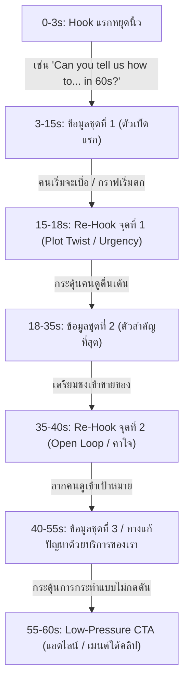

# 🪝 คู่มือยื้อคนดูในคลิปสั้นด้วย Re-Hook (Re-Hooking Mastery Guide)
> **สำหรับแบรนด์: Nick | Financetry**  
> *แก้ปัญหากราฟคนดูตกกลางคลิป เพิ่มอัตราความคงอยู่ (Retention Rate) และเพิ่มยอดแชร์ 300%*

---

## 💡 1. Re-Hook คืออะไร?

คนส่วนใหญ่รู้ว่าต้องมี **"Hook แรก" (3 วินาทีแรก)** เพื่อสะกดให้คนดูหยุดนิ้วโป้ง แต่ปัญหาที่ครีเอเตอร์ 90% ตกม้าตายคือ **"คนดูเลื่อนหนีวินาทีที่ 10-15"** เพราะเนื้อหากลางเรื่องเริ่มน่าเบื่อหรือเริ่มเดาทิศทางได้

> [!IMPORTANT]
> **Re-Hook คือ "เบ็ดตัวที่สอง ตัวที่สาม..."** ที่เราโยนเข้าไปกลางคลิป (ช่วงทุกๆ 10-15 วินาที) เพื่อทำหน้าที่ **กระตุ้นสมองคนดูให้ตื่นตัวอีกรอบ** ป้องกันไม่ให้กดเลื่อนหนี และดึงกราฟ Retention ในระบบวิเคราะห์หลังบ้านของ Instagram/TikTok ให้พุ่งสูงขึ้น

---

## 🔄 2. เปรียบเทียบ Hook VS Re-Hook

| คุณลักษณะ | Hook (เปิดคลิป) | Re-Hook (กลางคลิป) |
| :--- | :--- | :--- |
| **ตำแหน่ง** | วินาทีที่ 0 ถึง 3 | วินาทีที่ 15, 30, 45 (ทุกรอบที่ข้อมูลสำคัญจบตอน) |
| **หน้าที่หลัก** | หยุดนิ้วโป้งคนดู ไม่ให้เลื่อนหนี | ตรึงคนดูให้อยู่ต่อ จนถึงฉากจบ (CTA) |
| **ความรู้สึก** | หวือหวา, เปิดปัญหา, ตั้งคำถามแรงๆ | หักมุม, ห้ามหยุดฟัง, เฉลยจุดสำคัญ, ขยายสเกลความแรง |
| **เครื่องมือ** | คำพูดพาดหัว + ภาพสะดุดตา | ประโยคพลิกอารมณ์ + ปรับบีตเพลง + เปลี่ยนมุมภาพ |

---

## 🎨 3. ประเภทของ Re-Hook และแนวทางประยุกต์ใช้ (สไตล์ Financetry)

นี่คือ 4 เทคนิค Re-Hook ยอดนิยมที่ช่องการเงินล้านวิวใช้ยื้อคนดู พร้อมเทมเพลตคำพูดที่คุณนำไปอัดคลิปตามได้ทันที:

### 1️⃣ The Plot Twist (การหักมุมเชิงความรู้สึก)
*เป็นการเตือนหรือเบรกอารมณ์คนดูว่า ข้อมูลที่เขากำลังฟังอยู่ อาจจะมีหลุมพรางซ่อนอยู่ ถ้าทำผิดวิธีจะฉิบหาย*
*   **คำพูดเทมเพลต:** 
    *   *"แต่เดี๋ยวก่อนครับ... ทั้งหมดนี้จะไร้ค่าทันทีถ้าคุณลืมทำสิ่งนี้..."*
    *   *"ช้าก่อน! มีจุดหลุมพรางข้อหนึ่งที่คนส่วนใหญ่มักเข้าใจผิด..."*
    *   *"เรื่องจริงที่โหดร้ายกว่านั้นคืออะไร รู้ไหมครับ?"*
*   **การประยุกต์ใช้จริง:** *"ฝากเงินดิจิทัลดอกเบี้ย 2% ดีมากใช่ไหมครับ? แต่เดี๋ยวก่อนครับ... ทั้งหมดนี้จะไร้ค่าทันทีถ้าคุณลืมทำสิ่งนี้ นั่นคือดันไปฝากเกินโควตาขั้นต่ำ ดอกเบี้ยคุณจะดิ่งเหลือ 0.5% ทันที!"*

### 2️⃣ The Urgency Spike (การรีดพลังความสำคัญ / ชี้ความเป็นความตาย)
*ใส่คำพูดที่เน้นย้ำถึง ความเสียหายหรือการเสียสิทธิ์อันยิ่งใหญ่ หากคนดูปิดคลิปนี้ไปก่อนตอนจบ*
*   **คำพูดเทมเพลต:**
    *   *"ถ้าคุณไม่อยากเสียเงิน [จำนวนเงิน] ฟรีๆ ในปีหน้า ตั้งใจฟังข้อถัดไปดีๆ..."*
    *   *"ข้อที่ 3 นี้คือจุดตัดสินชีวิตเลยครับ..."*
    *   *"ตั้งใจดูหน้าจอตอนนี้เลยนะครับ เพราะนี่คือพาร์ทสำคัญที่สุด..."*
*   **การประยุกต์ใช้จริง:** *"สำหรับส่วนลดหย่อนภาษีแสนถัดไป... ตั้งใจดูหน้าจอตอนนี้เลยนะครับ เพราะนี่คือพาร์ทสำคัญที่สุด ถ้าคุณพลาดบรรทัดเดียว คุณอาจจะโดนสรรพากรเรียกภาษีย้อนหลังเป็นหมื่น!"*

### 3️⃣ Visual & Sound Reset (การล้างกระดานทัศนภาพ)
*เมื่อพูดหัวข้อจบไป 1 ข้อย่อย ให้เปลี่ยนทัศนภาพและสุ้มเสียงเพื่อ 'รีเซ็ตสมองคนดู' ป้องกันอาการเฉื่อยชา*
*   **วิธีปฏิบัติ:**
    *   **Sound Effect:** ใส่เสียง **"Deep Woosh"** หรือ **"Glitch Counter"** ระหว่างเปลี่ยนพาร์ท
    *   **Visual:** สลับมุมกล้องจาก **"คุยหน้ากล้อง (A-Roll)"** เป็นภาพ **"B-Roll แทรกลิปติกซูมกระดาษ/แท็บเล็ตคำนวณเงิน"**
    *   **Text Transition:** เด้งคีย์เวิร์ดตัวหนาสีแดง/เหลืองขึ้นเต็มจอพร้อมเอฟเฟกต์เสียงสั่นประสาท

### 4️⃣ The Micro-Open Loop (การเปิดประเด็นใหม่ค้างไว้)
*บอกสิ่งที่เขากำลังจะได้ฟังในอีกไม่กี่วินาทีข้างหน้า แต่ยังไม่เฉลยคำตอบ เพื่อให้สมองค้างคาและอยากดูต่อไปเรื่อยๆ*
*   **คำพูดเทมเพลต:**
    *   *"และนี่คือกองทุนที่คุณคิดไม่ถึงว่าจะทำแบบนี้ได้..."*
    *   *"ซึ่งวิธีแก้ปัญหานี้ ไม่ใช่การออมเพิ่ม แต่เป็นสิ่งที่ง่ายกว่านั้นมาก..."*
    *   *"คำตอบสุดท้ายอาจทำให้คุณตกใจ..."*
*   **การประยุกต์ใช้จริง:** *"ประกันสุขภาพเล่มแรกควรซื้อแบบเหมาจ่าย... แต่รู้ไหมครับ? วิธีประหยัดค่าเบี้ยตัวนี้ลง 50% ไม่ใช่การลดวงเงินคุ้มครอง แต่เป็นสิ่งง่ายๆ ที่ตัวแทนส่วนใหญ่ไม่เคยบอกคุณ..."*

---

## 🛠️ 4. แผนผังโครงสร้างคลิป 60 วินาทีแบบใส่ Re-Hook (Financetry Blueprint)

---

## 📝 5. 3 กฎทองในการเขียน Re-Hook
1.  **ห้ามมีช่องว่างความเงียบ (No Dead Air):** การเปลี่ยนพาร์ทหรือใช้ Re-Hook ต้องลื่นไหลรวดเร็ว ใช้เสียง Sound Effect เช็ดท้ายคำพูดเสมอ
2.  **ตรงประเด็น ไม่เยิ่นเย้อ:** ประโยค Re-Hook ควรมีความยาวเพียง 1 ประโยคสั้นๆ (ไม่เกิน 3-4 วินาที) แล้วลากสปอตไลท์ไปที่ข้อมูลต่อไปทันที
3.  **มีเหตุผลสมรองรับ:** อย่าใช้ประโยคเตือนหรือหักมุมแบบหลอกหลวง (Clickbait หลอกๆ) หากคุณบอกว่า "เรื่องนี้ห้ามพลาด" ข้อมูลข้อถัดไปต้องเจ๋งจริงตามคำโม้เพื่อรักษาความเชื่อใจของแบรนด์ Nick | Financetry
