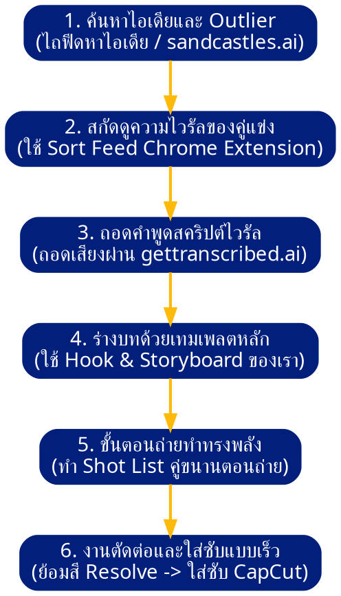

# ⚡ ศูนย์บัญชาการระบบครีเอเตอร์สร้างแบรนด์บุคคล (Creator Dashboard)
> สถานะระบบ: ออนแอร์สมบูรณ์แบบ | ประเภท: แผงควบคุมหลักผู้สร้าง | อัปเดตล่าสุด: 2026-05-18

ยินดีต้อนรับสู่ระบบงานผลิตวิดีโอและการสร้างตัวตน (Personal Branding Engine) ระดับมืออาชีพ หน้าแดชบอร์ดนี้คือกุญแจหลักที่หลอมรวมสเปก คัมภีร์จัดกล้อง ระบบสี และพิมพ์เขียวสร้างแบรนด์ระดับโลกของ Jack (School of Hard Knocks) คู่มืองานพิมพ์เขียว และคลัง Hook ไวรัลของ Orcalynx ไว้ด้วยกันในคลิกเดียว

---

## 📂 1. เมนูคู่มือระบบทำงานแยกหมวด (Creator Workspace Guides)

คลิกเปิดดูรายละเอียดคู่มือการทำงานเฉพาะทางแต่ละส่วนได้จากลิงก์ด้านล่างนี้:

* 📸 **[คู่มือการจัดแสง ถ่ายทำ และเกรดโทนสี D-Log M](production/camera-and-grading.md)**  
  *(รวบรวมค่ากล้อง 4K/30fps, สูตร CST DJI D-Gamut, การย้อมสีสกินโทน และสูตรเบลอหลังแบบพรีเมียม)*
* 🎵 **[คู่มือระบบดนตรีประกอบและเสียงไวรัล](production/background-music.md)**  
  *(ตารางปรับระดับเดซิเบล DB ในการมิกซ์เสียงไม่ให้กลบเสียงพูด และเทคนิคปิดเสียงดักจับเพลงไวรัลใน IG)*
* 🪝 **[คลังหัวข้อสะกดสายตาไวรัล (Hook & Re-Hook Vault)](writing/viral-hook-vault.md)**  
  *(รวบรวมพิมพ์เขียว Anti-Vision vs. Vision, วิธีใช้ External Outliers และคลังหัวข้อ Hook 50/20)*
* 📄 **[โครงสร้างสตอรี่บอร์ดและเทมเพลตสคริปต์ Reels](writing/video-templates.md)**  
  *(แม่แบบสคริปต์ Value & Storytelling จาก Jack, วิธีแกะบทคู่แข่ง และการทำซับสีกระตุ้นตาใน CapCut)*

### 🛠️ **คลังไฟล์ทักษะความรู้ใหม่ที่คุณเพิ่งส่งมอบมา (New Core Knowledge Assets):**
* 🧠 **[คัมภีร์ใช้งาน AI เขียนบทสคริปต์ไวรัล (Instagram Script Writer Skill)](skills/instagram-script-writer-skill.md)**  
  *(ไฟล์ระบบเจาะจงทักษะ AI ที่สกัดบริบทความต้องการลึก ๆ ของกลุ่มเป้าหมาย เพื่อสั่งให้ AI ร่างสคริปต์พรีเมียมคุมโทน)*
* 📓 **[คลังต้นฉบับ 350+ Orcalynx Hooks Library](raw/raw-orcalynx-hooks-library.md)**  
  *(รวบรวมทุกลิสต์สูตรประโยคพาดหัวไวรัลดึงดูดสายตา 1-355 ครบถ้วนไม่มีตกหล่นแม้แต่ตัวอักษรเดียว)*
* 📊 **[ต้นฉบับระบบวางแผน 7 Prompts สร้าง 60 Carousels](raw/raw-7-prompts-60-carousels.md)**  
  *(แม่แบบรัน Prompt ต่อเนื่องเพื่อสร้างตารางแผนคอนเทนต์สำหรับ 1 ปีเต็ม ในแชทเดียว)*
* 💡 **[ต้นฉบับระบบเจน 20 สคริปต์ของ Jack](raw/raw-20-viral-scripts-framework.md)**  
  *(แกนแนวคิด ICP + Offer + Zoom meeting เพื่อเจนบทสคริปต์ 10 Viral + 10 Conversion ใน 10 นาที)*
* 🎙️ **[ต้นฉบับบันทึกสคริปต์แบรนด์บุคคลของ Jack](raw/raw-jack-personal-brand-transcript.md)**  
  *(บทเรียนคัมภีร์ล้านเหรียญฉบับสมบูรณ์เกี่ยวกับ Brand Outliers, Funnel Formats และการถอดบทคู่แข่ง)*

---

## 🔗 2. คลังรวมของเล่นและลิงก์ภายนอกด่วน (Quick Access Link Grid)

นี่คือ "ปุ่มกดลิงก์ด่วน" ไปหาทรัพยากรทุกอย่างที่คุณแชร์ไว้ภายนอก เพื่อให้คุณคลิกเปิดใช้งานในคลิกเดียว:

### 🎨 **ฝั่งงานภาพ โทนสีผิว และโปรดักชั่น:**
* 📁 **[Google Drive คลังโทนสี LUTs ดาวน์โหลดฟรี] (คลัง andrewsbodega ทางเลือก):**  
  [👉 คลิกเปิด Google Drive เพื่อโหลดไฟล์ `.cube`](https://drive.google.com/drive/folders/1W1XuajFOMiU_BwA_z0E-pCpvbj1EkofJ)
* 🎥 **[สไตล์ต้นแบบช่องที่แนะนำให้ศึกษาการทำภาพ (IG: @longevitypenguin)]:**  
  [👉 คลิกเปิดดูไอจีตัวอย่าง](https://www.instagram.com/longevitypenguin?igsh=MXBuOTc5ZjJmMTkzaA==)
* 💡 **[เรียนรู้วิธีการย้อมเกรดสีผิวบน YouTube]:**  
  [👉 คลิกดูคลิปวิดีโอสอนสอนเกรดสี](https://m.youtube.com/watch?v=_URbiKp2r8E)

### 🎵 **ฝั่งดนตรีประกอบและเพลงไวรัล:**
* 🗂️ **[Notion Calico Index Music Library]:**  
  [👉 คลิกเปิด Notion คลังเพลง 1](https://calico-index-264.notion.site/Music-Library-261e760164e180a2a094cd4d7f86e5b6?fbclid=PAT01DUARsK-pleHRuA2FlbQIxMABzcnRjBmFwcF9pZA81NjcwNjczNDMzNTI0MjcAAafFZNbThmWoq_NDoXSi3aEkf_5mTgSBU3ezbmWf7s3Yr83CKFNV1OsnPfg6XA_aem_0Gk5N9yKUIPOJXYY8glLIg)
* 🗂️ **[Notion Background Music Library]:**  
  [👉 คลิกเปิด Notion คลังเพลง 2](https://creator-economy.notion.site/Background-Music-Library-492fde9e1dc24f978608c66871789e44?pvs=149)
* 🗂️ **[Notion 150 Viral Songs คลังเพลงดึงดูดกระแส]:**  
  [👉 คลิกเปิด Notion คลังเพลง 3](https://lemon-turret-474.notion.site/150-Viral-Songs-356a5260bd2580fab5ead5da6e891d12?fbclid=PAT01DUARvlgdleHRuA2FlbQIxMABzcnRjBmFwcF9pZA81NjcwNjczNDMzNTI0MjcAAadWbgld6X1ZyfBxezcVjVYwcBTYRJdWGqPB6mXv_qj7VbLHvzFbDDPCZIlfag_aem_JSV7ZEF4rqrgcRkNWJtVjQ)

### 🪝 **ฝั่งการเขียนบทและแม่แบบคลิปไวรัล:**
* 📓 **[Notion 50 Viral Hook Templates]:**  
  [👉 คลิกเปิดคลัง Hook แม่แบบ 50 ชุด](https://lemon-turret-474.notion.site/50-Viral-Hook-Templates-263a5260bd25806c828be027a5467918)
* 📓 **[Notion 20 Viral Hooks]:**  
  [👉 คลิกเปิดคลัง Hook แม่แบบ 20 ชุด](https://lemon-turret-474.notion.site/20-Viral-Hooks-2f9a5260bd25808ab173da1b0360d513)
* 🌐 **[Orcalynx Hooks Generator หน้าเว็บกดเจนพาดหัวอัตโนมัติ]:**  
  [👉 คลิกเปิดใช้งานเว็บพาดหัว](https://www.orcalynx.com/hooks/index.html?utm_source=sp_auto_dm&utm_referrer=sp_auto_dm&fbclid=PAT01DUAR3erdleHRuA2FlbQIxMABzcnRjBmFwcF9pZA81NjcwNjczNDMzNTI0MjcAAafb7j2weyppsTnJ2CFtKUSjdPZvrLfCthGfZIeDHO3yiidJN2-xguCXtOuV3w_aem_k_-7F1IWEfKFZu4L8Z1GRA)
* 📋 **[Notion Re-Hook Guide คู่มือยื้อคนดูในคลิปสั้น]:**  
  [👉 คลิกเปิดคู่มือ Notion](https://cypress-road-140.notion.site/REHOOK-GUIDE-2a2592d6835680f59c0ecac3c7d666f5?fbclid=PAT01DUAReZiRleHRuA2FlbQIxMABzcnRjBmFwcF9pZA81NjcwNjczNDMzNTI0MjcAAae02qXEA4et9cBN_4qwSaJ84oNR7SaIaORob20Zwd2bqihzWiMvkXh4plD4MA_aem_nig12ELtOtorGFcSGobssg)
* 🎬 **[Notion Plug-N-Play Full Video Templates แม่แบบสคริปต์สมบูรณ์]:**  
  [👉 คลิกเปิดแม่แบบ Notion](https://cypress-road-140.notion.site/PLUG-N-PLAY-FULL-VIDEO-TEMPLATES-2b6592d68356800885ccc8ce3fe7469d?fbclid=PAT01DUAReZZZleHRuA2FlbQIxMABzcnRjBmFwcF9pZA81NjcwNjczNDMzNTI0MjcAAae02qXEA4et9cBN_4qwSaJ84oNR7SaIaORob20Zwd2bqihzWiMvkXh4plD4MA_aem_nig12ELtOtorGFcSGobssg)

---

## 🔄 3. แผนภาพลำดับการทำงานรายวัน (Daily 6-Step Creator Workflow)

ใช้กระบวนการทำงานที่เป็นระบบในการรีเสิร์ช เขียนบท และตัดต่อ เพื่อความสม่ำเสมอและไม่เสียเวลาไถฟีดเปล่าประโยชน์:

---

## 📈 4. ระบบการวัดผลและคัดกรองลูกค้า (Metrics & Lead Tracker Setup)

การโพสต์คลิปอย่างสะเปะสะปะโดยไม่วิเคราะห์ข้อมูล จะไม่สามารถแปรเปลี่ยนยอดวิวเป็นรายได้หลักล้านได้ ให้ตั้งแผงข้อมูลวัดผลของคุณใน Notion หรือ Excel ตามโครงสร้างนี้:

### **📊 A. บอร์ดชี้วัดความสามารถคลิป (Content Performance Tracker)**
นอกจากยอดวิว ยอดคอมเมนต์ หรือยอดแชร์ปกติแล้ว ตัวเลขที่สำคัญที่สุดในการวัดผลคือ:
$$\text{Followers per 1,000 Views} = \left( \frac{\text{ยอดผู้ติดตามที่ได้จากคลิปนี้}}{\text{ยอดวิวรวมของคลิปนี้}} \right) \times 1,000$$
* *ทำไมถึงสำคัญ:* บางคลิปมียอดวิวสูงเป็นแสนวิวแต่ยอดผู้ติดตามเพิ่มแค่ 5 คน ในขณะที่บางคลิปมียอดวิวแค่ 1 หมื่นวิวแต่คนติดตามเพิ่มขึ้น 50 คน ตัวเลขนี้จะบอกคุณทันทีว่า **"หัวข้อคอนเทนต์ตัวไหนที่โดนใจแฟนคลับตัวจริง"** เพื่อให้คุณทวีคูณการทำคอนเทนต์ประเด็นนั้นซ้ำ ๆ 

### **🎯 B. บอร์ดบันทึกพอร์ตลูกค้า (Lead Tracker Table)**
ให้ผู้ช่วย (VA) หรือทีมงานของคุณบันทึกรายชื่อผู้มุ่งหวังที่ทัก DM หรือคอมเมนต์ขอชีทแจกฟรีทุกวันตามตารางนี้:

| 👤 IG แอคเคานต์ | 🚦 คะแนนประเมิน (Quality 1-10) | 💼 โดเมนเป้าหมาย (Niche) | 🎬 คลิปต้นเหตุที่ทักเข้ามา (Source Video) | 📈 สถานะการติดต่อ (Outreach Status) |
| :--- | :--- | :--- | :--- | :--- |
| `@somchai_design` | **9 / 10** | โค้ชสอนออกแบบ UI/UX | *คลิปแบนคอร์สพันบาท* | ส่งชีท High-ticket blueprint แล้ว นัดคุยสัปดาห์หน้า |
| `@dilan_fitness` | **7 / 10** | เทรนเนอร์ฟิตเนสออนไลน์ | *คลิปเทียร์ลดไขมันหน้าท้อง* | กำลังปฏิสัมพันธ์ทักทายหน้าฟีด |

---

## ⚡ 5. ข้อมูลด่วนอ้างอิงไว (Quick Reference Cheat Sheet)

* **ความละเอียดถ่ายทำ:** 4K | **เฟรมเรท:** 30 fps (Nothing Phone 2a) | **สี:** D-Log M
* **สูตรแปลงสี DaVinci Resolve (CST):** DJI D-Gamut & Gamma 2.4 ➔ Rec.709 & Gamma 2.4
* **การส่งออกลง IG ที่ดีที่สุด:** ความละเอียด **1440 x 2560** | คอนสแตนท์บิตเรท **CBR @ 17 Mbps** | ตัวเข้ารหัส **HEVC (h.265)**
