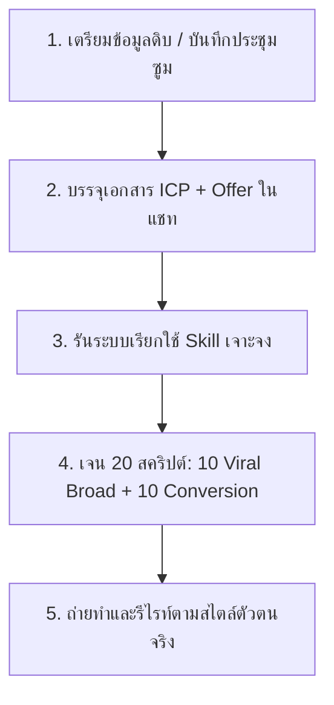

# 20 Viral Instagram Scripts in Under 10 Minutes
> โครงสร้างระบบการทำงาน AI Scripting Engine ระดับพรีเมียม (ส่งมอบ: 2026-05-18)

---

## 🎙️ หลักการและวิสัยทัศน์ของระบบ (Core Concept)
ครีเอเตอร์ส่วนใหญ่ที่ใช้ AI ร่างสคริปต์เขียนบท มักจะได้รับเนื้อหาประเภท **"ขยะทั่วไป (Generic Content)"** ที่อ่านแล้วดูเป็น AI มากเกินไป ไร้จิตวิญญาณและปิดการขายไม่ได้ 

สาเหตุไม่ใช่เพราะ AI ทำงานไม่เก่ง แต่เกิดจาก **"กระบวนการป้อนบริบท (In-context System)"** ที่ไม่ถูกต้อง

ระบบนี้จะสวมบทบาทเป็นเสมือน "ที่ปรึกษาการเขียนคำโฆษณา (Professional Marketer/Copywriter)" ส่วนตัวในเครื่องของคุณ โดยขับเคลื่อนด้วย **3 ข้อมูลสำคัญ (The 3 Pillars of AI Content System):**

1. **Instagram Script Writer Skill (คลังทักษะและกรอบความคิด):** เป็นตัวจัดเก็บโครงสร้างสคริปต์ไวรัล วิธีการเขียน Hook 50/20 แบบเจาะจง และแนวทางการวางจังหวะภาพ
2. **ICP Document (โปรไฟล์ลูกค้าในอุดมคติ):** เพื่อระบุว่าเรากำลังคุยกับใคร ความเจ็บปวดลึก ๆ ของเขาคืออะไร และภาษาที่เขาเข้าใจเป็นแบบไหน
3. **Offer Document & Context Source (ข้อเสนอและสวัสดิการ):** เช่น เอกสารสิทธิ์ข้าราชการ แผนการรักษาพยาบาล AIA หรือคลิปบันทึกประชุมซูมกับลูกค้าเพื่อสะกัดหา Pain Points จริงมาแปลงเป็นเนื้อหา

---

## ⚙️ ขั้นตอนการรันระบบแบบก้าวหน้า (The Actionable Workflow)

### 1️⃣ ขั้นเตรียมบริบทที่แท้จริง (Juicy Context)
* ใช้บันทึกจากการประชุมซูม (Zoom Calls), FAQ จาก DMs ของลูกค้า หรือคำตอบจาก Onboarding Form ของกลุ่มผู้มุ่งหวัง
* ดาวน์โหลดบทถอดเสียงตัวเต็มเพื่อป้อนลงไปใน Claude เพื่อเป็นวัตถุดิบในการสร้างสรรค์

### 2️⃣ คำสั่งคำสั่งรันระบบ (The Master Prompt)
* **Prompt:**  
  `Hey, during this group call, I did some market research at the end and I was asking my community members about their pain points, what they're struggling with right now. I need you to extract 20 scripts: 10 viral broad ideas and then 10 ideas optimized for conversion. Use your Instagram script writer skill for this task and deliver me a table of contents and full scripts.`

---

## 💎 ตัวอย่างเคสสคริปต์แห่งความสำเร็จ (Winning Script Concept Study)

### **🎬 เคสวิดีโอ: "ผมเพิ่งลบระบบออโตเมชั่นทิ้ง (I deleted my automations)"**
* **สไตล์ความไวรัล:** ขัดแย้งกับกระแสสังคม (Contrarian Hook) ดึงดูดความสนใจได้ดีเยี่ยม
* **โครงสร้างการพูด:**
  * *เปิด Hook:* *"ทุกคนกำลังคลั่งไคล้การสร้างระบบ AI Automations แต่ผมเพิ่งกดลบระบบอัตโนมัติของผมทิ้งทั้งหมด..."*
  * *ขยี้ปัญหา (Problem):* *"...ไม่ใช่เพราะผมไม่ชอบเทคโนโลยี แต่ความจริงคือผมเสียเวลาสร้าง Workflows ไปกว่า 10 ชั่วโมงเพียงเพื่อจะเห็นมันพังในอีกไม่กี่วันถัดมา"*
  * *สร้างตรรกะใหม่ (Logical Shift):* *"ความจริงคือการสร้างระบบที่แข็งทื่อและซับซ้อนเกินไปจะตาม AI ที่อัปเดตทุกสัปดาห์ไม่ทัน การหันมาแชทคุยกับ AI แบบยืดหยุ่นโดยตรงช่วยเซฟเวลาไปกว่าครึ่ง"*
  * *ปิดด้วย Call to Action (CTA):* *"พิมพ์คอมเมนต์คำว่า **'SKILL'** ด้านล่างนี้ แล้วผมจะส่งแชร์ระบบทักษะที่ผมใช้แชทส่วนตัวกับ Claude ให้ถึงมือคุณใน DM"*

---

## 📈 วิธีดัดแปลงใช้งานกับการขายบริการราคาสูง (High-Ticket Offer Conversion)
แทนที่จะพูดเรื่อง "ขายคอร์สเรียน" หรือ "บริการทั่วไป" แบบทื่อ ๆ ให้สลับเรื่องราวโดยอิงจากวิถีคิดระบบนี้:
* **เปิด Contrarian Hook:** *"ผมเพิ่งบอกให้โค้ชคนหนึ่งหยุดทำคอร์สออนไลน์ราคา 990 บาทของเขาทิ้งไปให้หมด..."*
* **ขยี้ปัญหา (Problem):* *"...ไม่ใช่เพราะคอร์สเขาไม่ดี แต่เพราะผมคำนวณแล้วว่าการต้องหาสมาชิกใหม่ให้ได้ 100 คนต่อเดือนเพื่อให้อยู่รอด กำลังทำลายสุขภาพของเขาและทำเงินได้น้อยกว่าการทำ High-ticket offer ชิ้นเดียวถึง 10 เท่า"*
* **ชี้ทิศทางแก้ไข (Logical Shift):** *"การจัดโครงสร้างบริการใหม่แบบ 1-on-1 Premium Coaching แล้วขายในราคา 30,000 บาทให้กับคนที่ใช่เพียงแค่ 3 คนต่อเดือน คือการปิดดีลและสร้างแบรนด์ที่ทรงพลังที่สุด"*
* **ปิด CTA เร่งคอมเมนต์:** *"พิมพ์คำว่า **'OFFER'** แล้วผมจะส่งพิมพ์เขียววิธีกระโดดข้ามจากหลักร้อยสู่ดีลหลักหมื่นไปให้คุณในข้อความส่วนตัวทันที"*

